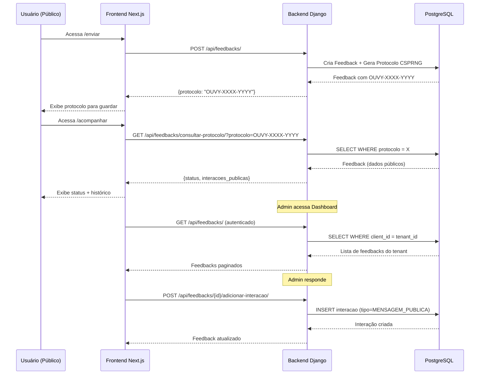

# 🔍 RELATÓRIO DE AUDITORIA TÉCNICA - OUVIFY SAAS

**Data:** 30 de Janeiro de 2026  
**Branch de Auditoria:** `audit/2026-01-30`  
**Auditor:** Engenheiro Sênior de Auditoria  
**Escopo:** Monorepo ouvy_saas - MVP White Label  

---

## 📋 SUMÁRIO EXECUTIVO

### Status Geral do MVP

| Funcionalidade | Status | Completude |
|----------------|--------|------------|
| Canal de Feedback (denúncia, reclamação, sugestão, elogio) | ✅ Funcional | 95% |
| Geração de Código de Rastreio | ✅ Funcional | 100% |
| Acompanhamento Público por Protocolo | ✅ Funcional | 100% |
| Painel Admin/Triagem | ✅ Funcional | 90% |
| Comunicação com Usuário | ✅ Funcional | 95% |
| Multi-tenant/White Label | ✅ Funcional | 95% |
| Segurança e LGPD | ⚠️ Parcial | 85% |
| Documentação | ⚠️ Incompleta | 60% |

### Resumo de Achados por Severidade

| Severidade | Quantidade | Descrição |
|------------|------------|-----------|
| 🔴 Critical | 2 | Requerem correção imediata antes do deploy |
| 🟠 High | 5 | Devem ser corrigidos antes do release |
| 🟡 Medium | 8 | Corrigir no próximo sprint |
| 🔵 Low | 6 | Melhorias recomendadas |

---

## 📊 FASE 1 - MAPA DO SISTEMA

### 1.1 Arquitetura Geral

```
ouvy_saas/
├── apps/
│   ├── backend/          # Django + DRF (API REST)
│   │   ├── apps/
│   │   │   ├── core/         # TenantAwareModel, Middleware, Utils
│   │   │   ├── feedbacks/    # CRUD Feedbacks, Protocolo, Interações
│   │   │   ├── tenants/      # Multi-tenancy, Planos, Team Members
│   │   │   ├── notifications/# Push Notifications
│   │   │   ├── auditlog/     # Logs de Auditoria
│   │   │   ├── consent/      # Gestão de Consentimento LGPD
│   │   │   ├── billing/      # Stripe Integration
│   │   │   └── webhooks/     # Webhooks & Integrações
│   │   └── config/           # Settings, URLs, WSGI
│   └── frontend/         # Next.js 14+ (App Router)
│       └── app/
│           ├── (marketing)/  # Landing pages públicas
│           ├── acompanhar/   # Consulta pública por protocolo
│           ├── enviar/       # Envio de feedback
│           ├── dashboard/    # Painel administrativo
│           ├── login/        # Autenticação
│           └── cadastro/     # Registro de tenant
├── packages/             # Monorepo shared packages
│   ├── config/          # Configurações compartilhadas
│   ├── types/           # TypeScript types
│   └── ui/              # Componentes UI compartilhados
├── monitoring/          # Prometheus, Grafana, Alertmanager
├── nginx/               # Configurações Nginx
├── tests/               # Testes E2E e de integração
└── docs/                # Documentação existente
```

### 1.2 Fluxo Principal: Feedback → Tracking Code → Acompanhamento → Triagem



### 1.3 Modelos Principais (Django)

| Modelo | App | Função | Campos Chave |
|--------|-----|--------|--------------|
| `Client` | tenants | Tenant (empresa cliente) | subdominio, plano, stripe_* |
| `TeamMember` | tenants | Usuários do tenant | user FK, client FK, role |
| `Feedback` | feedbacks | Feedback/Denúncia | tipo, protocolo, status, client FK |
| `FeedbackInteracao` | feedbacks | Mensagens/Notas | feedback FK, tipo, mensagem |
| `FeedbackArquivo` | feedbacks | Anexos | arquivo (Cloudinary) |
| `Tag` | feedbacks | Categorização | nome, cor |
| `ResponseTemplate` | feedbacks | Templates de resposta | titulo, conteudo, categoria |
| `Notification` | notifications | Push notifications | user FK, title, read |
| `UserConsent` | consent | Consentimentos LGPD | user FK, consent_version FK |
| `WebhookEndpoint` | webhooks | URLs de webhook | url, events, secret |

### 1.4 Rotas do Frontend (Next.js App Router)

| Rota | Tipo | Autenticação | Função |
|------|------|--------------|--------|
| `/` | Marketing | Pública | Landing page |
| `/recursos` | Marketing | Pública | Features |
| `/precos` | Marketing | Pública | Planos e preços |
| `/enviar` | Pública | ❌ | Enviar feedback |
| `/acompanhar` | Pública | ❌ | Consultar por protocolo |
| `/login` | Pública | ❌ | Login |
| `/cadastro` | Pública | ❌ | Registro de tenant |
| `/dashboard` | Privada | ✅ JWT | Dashboard principal |
| `/dashboard/feedbacks` | Privada | ✅ JWT | Listagem de feedbacks |
| `/dashboard/feedbacks/[protocolo]` | Privada | ✅ JWT | Detalhe de feedback |
| `/dashboard/equipe` | Privada | ✅ JWT | Gestão de equipe |
| `/dashboard/configuracoes` | Privada | ✅ JWT | Configurações do tenant |
| `/dashboard/assinatura` | Privada | ✅ JWT | Plano/Billing |
| `/dashboard/analytics` | Privada | ✅ JWT | Métricas e SLA |
| `/dashboard/auditlog` | Privada | ✅ JWT | Logs de auditoria |

### 1.5 Endpoints da API (Django REST Framework)

#### Feedbacks
- `POST /api/feedbacks/` - Criar feedback (público)
- `GET /api/feedbacks/` - Listar feedbacks (autenticado)
- `GET /api/feedbacks/{id}/` - Detalhe (autenticado)
- `GET /api/feedbacks/consultar-protocolo/` - Consulta pública
- `POST /api/feedbacks/responder-protocolo/` - Resposta pública
- `POST /api/feedbacks/{id}/adicionar-interacao/` - Adicionar interação
- `POST /api/feedbacks/{id}/assign/` - Atribuir a team member
- `GET /api/feedbacks/dashboard-stats/` - Estatísticas
- `GET /api/feedbacks/analytics/` - Analytics avançado

#### Tenant & Auth
- `POST /api/token/` - Login JWT
- `POST /api/token/refresh/` - Refresh JWT
- `GET /api/tenant-info/` - Info do tenant atual
- `POST /api/register-tenant/` - Criar novo tenant
- `GET /api/users/me/` - Dados do usuário logado

---

## 🔴 FASE 2 - ACHADOS CRÍTICOS E HIGH

### 2.1 [CRITICAL] SEC-001: SECRET_KEY de Desenvolvimento no .env

**Arquivo:** `apps/backend/.env` (linha 7)  
**Evidência:**
```dotenv
SECRET_KEY=django-insecure-dev-key-for-local-only-do-not-use-in-production
```

**Impacto:** Se este arquivo for commitado ou usado em produção, a chave permite:
- Forjar sessões de admin
- Decodificar tokens JWT
- Falsificar CSRF tokens

**Severidade:** 🔴 CRITICAL

**Correção Recomendada:**
1. Garantir que `.env` está no `.gitignore` (✅ já está)
2. Em produção (Railway), usar variável de ambiente diferente
3. O settings.py já tem validação para produção (✅ correto)

**Status:** ⚠️ Requer verificação no Railway - confirmar que SECRET_KEY de produção é diferente

---

### 2.2 [CRITICAL] SEC-002: Diretórios venv/ e .venv/ na raiz do repo

**Evidência:**
```bash
$ find . -type d -name "venv" -o -name ".venv"
./.venv
./venv
```

**Impacto:** 
- Dois virtualenvs duplicados (desperdício de espaço)
- Podem conter dependências diferentes, causando inconsistências
- Arquivos .pyc podem vazar informações sensíveis

**Severidade:** 🔴 CRITICAL (se versionados) / 🟡 MEDIUM (se apenas locais)

**Correção Recomendada:**
```bash
# Remover do git tracking se existir
git rm -r --cached venv/ .venv/ 2>/dev/null

# Padronizar para apenas 1 venv
rm -rf .venv/  # Manter apenas venv/

# Verificar .gitignore (já está correto)
```

---

### 2.3 [HIGH] SEC-003: Rota `/notifications` não existe mas é referenciada

**Arquivo:** `apps/frontend/components/notifications/NotificationCenter.tsx` (linha 274)  
**Evidência:**
```tsx
href="/notifications"
```

**Verificação:**
```bash
$ ls apps/frontend/app/notifications/
# Arquivo não encontrado
```

**Impacto:** Link quebrado na interface do usuário, 404 em produção

**Severidade:** 🟠 HIGH

**Correção Recomendada:**
- Criar `apps/frontend/app/(dashboard)/notifications/page.tsx`
- Ou alterar o link para `/dashboard/notifications` se existir

---

### 2.4 [HIGH] PERF-001: Possível N+1 Query no WebhookDeliveryViewSet

**Arquivo:** `apps/backend/apps/webhooks/views.py` (linhas 157-161)  
**Evidência:**
```python
def get_queryset(self):
    tenant = get_current_tenant()
    if not tenant:
        return WebhookDelivery.objects.none()
    return WebhookDelivery.objects.filter(
        endpoint__client=tenant
    ).order_by('-created_at')[:100]
```

**Impacto:** Falta `select_related('endpoint', 'event')`, causando queries adicionais ao acessar esses campos

**Severidade:** 🟠 HIGH (performance em produção)

**Patch Sugerido:**
```python
def get_queryset(self):
    tenant = get_current_tenant()
    if not tenant:
        return WebhookDelivery.objects.none()
    return WebhookDelivery.objects.filter(
        endpoint__client=tenant
    ).select_related('endpoint', 'event').order_by('-created_at')[:100]
```

---

### 2.5 [HIGH] SEC-004: Endpoint Público de Consulta de Protocolo sem Validação de Tenant Completa

**Arquivo:** `apps/backend/apps/feedbacks/views.py` (consultar_protocolo action)  
**Evidência:** O endpoint `consultar-protocolo` está na lista EXEMPT_URLS do TenantMiddleware

**Análise:**
```python
# middleware.py
EXEMPT_URLS = [
    ...
    '/api/feedbacks/consultar-protocolo/',  # Consulta pública de protocolo
    ...
]
```

O endpoint permite consulta sem tenant identificado, mas o código:
1. ✅ Usa rate limiting (10/min)
2. ✅ Protocolo é CSPRNG (não enumerável)
3. ⚠️ Retorna dados que podem incluir email_contato se não anônimo

**Impacto:** Potencial vazamento de PII se resposta não sanitizada

**Severidade:** 🟠 HIGH

**Correção Recomendada:** Verificar o serializer FeedbackConsultaSerializer para garantir que não expõe email_contato

---

### 2.6 [HIGH] LGPD-001: Falta Endpoint de Exclusão Completa (Right to be Forgotten)

**Arquivo:** `apps/backend/apps/core/lgpd_views.py`  
**Evidência:** Existe `AccountDeletionView` mas:

```python
# Verificar se apaga TODOS os dados relacionados
```

**Impacto:** LGPD exige exclusão completa de todos os dados pessoais

**Severidade:** 🟠 HIGH (compliance)

**Correção Recomendada:**
1. Verificar cascade deletes nos models
2. Implementar soft delete com período de retenção
3. Documentar processo de exclusão em `/docs/lgpd.md`

---

## 🟡 FASE 2 - ACHADOS MEDIUM

### 2.7 [MEDIUM] CFG-001: Duplicação de Configuração de Segurança

**Arquivo:** `apps/backend/config/settings.py` (linhas 91-98 e 424-433)  
**Evidência:**
```python
# Linha 91-98
if not DEBUG:
    SECURE_HSTS_SECONDS = 31536000
    ...

# Linha 424-433 (duplicado)
if not DEBUG:
    SECURE_SSL_REDIRECT = True
    ...
```

**Impacto:** Confusão na manutenção, possíveis inconsistências

**Severidade:** 🟡 MEDIUM

---

### 2.8 [MEDIUM] CFG-002: BASE_DIR Definido Duas Vezes

**Arquivo:** `apps/backend/config/settings.py` (linhas 25-26)  
**Evidência:**
```python
BASE_DIR = Path(__file__).resolve().parent.parent

# Build paths inside the project like this: BASE_DIR / 'subdir'.
BASE_DIR = Path(__file__).resolve().parent.parent
```

**Impacto:** Código redundante

**Severidade:** 🟡 MEDIUM

---

### 2.9 [MEDIUM] DOC-001: Falta de .env.example no Backend

**Arquivo:** `apps/backend/.env` existe mas não há `.env.example`  
**Impacto:** Novos desenvolvedores não sabem quais variáveis configurar

**Severidade:** 🟡 MEDIUM

---

### 2.10 [MEDIUM] TEST-001: Cobertura de Testes Incompleta

**Diretório:** `apps/backend/apps/*/tests/`  
**Evidência:** Faltam testes para:
- `apps/webhooks/` (views testadas parcialmente)
- `apps/billing/` (feature gating)
- `apps/consent/` (endpoints)

**Severidade:** 🟡 MEDIUM

---

## 🔵 FASE 2 - ACHADOS LOW

### 2.11 [LOW] CODE-001: Type Hints Incompletos

**Vários arquivos Python**

### 2.12 [LOW] UI-001: Console.log em Produção

**Arquivo:** `apps/frontend/next.config.ts`  
**Status:** ✅ Já configurado para remover em produção

### 2.13 [LOW] PERF-002: Falta de Índice Composto Otimizado

**Arquivo:** `apps/backend/apps/feedbacks/models.py`  
**Status:** ✅ Já tem índices otimizados

---

## ✅ FASE 3 - CHECKLIST DE SEGURANÇA DJANGO

### 3.1 Middleware Stack

| Middleware | Status | Observação |
|------------|--------|------------|
| SecurityMiddleware | ✅ | Posição 1 (correto) |
| SessionMiddleware | ✅ | |
| CorsMiddleware | ✅ | Após Session |
| CsrfViewMiddleware | ✅ | Habilitado |
| AuthenticationMiddleware | ✅ | |
| TenantMiddleware | ✅ | Custom |
| SecurityHeadersMiddleware | ✅ | Custom (CSP, etc) |

### 3.2 Configurações de Segurança

| Setting | Produção | Status |
|---------|----------|--------|
| DEBUG | False | ✅ Validado em settings.py |
| SECRET_KEY | Env var | ✅ Validado |
| ALLOWED_HOSTS | Lista específica | ✅ Validado |
| SECURE_SSL_REDIRECT | True | ✅ |
| SESSION_COOKIE_SECURE | True | ✅ |
| CSRF_COOKIE_SECURE | True | ✅ |
| SECURE_HSTS_SECONDS | 31536000 | ✅ |
| X_FRAME_OPTIONS | DENY | ✅ |
| SECURE_CONTENT_TYPE_NOSNIFF | True | ✅ |

### 3.3 Autenticação e Autorização

| Verificação | Status |
|-------------|--------|
| JWT como auth principal | ✅ |
| Token blacklist habilitado | ✅ |
| Rate limiting por tenant | ✅ |
| Rate limiting por IP | ✅ |
| Isolamento multi-tenant | ✅ TenantAwareModel |
| Validação de owner/tenant em endpoints | ✅ |

### 3.4 Fluxo do Tracking Code (Protocolo)

| Verificação | Status | Observação |
|-------------|--------|------------|
| Geração CSPRNG | ✅ | secrets.choice() |
| Formato não-sequencial | ✅ | OUVY-XXXX-YYYY |
| Espaço de busca | ✅ | 36^8 = 2.8 trilhões |
| Rate limiting | ✅ | 10/min por IP+Protocolo |
| Resposta pública mínima | ⚠️ | Verificar serializer |

---

## 📦 FASE 4 - VARIÁVEIS DE AMBIENTE

### 4.1 Backend Django (Obrigatórias em Produção)

| Variável | Obrigatória | Default | Descrição |
|----------|-------------|---------|-----------|
| `SECRET_KEY` | ✅ SIM | Erro se ausente | Chave criptográfica Django |
| `DEBUG` | ❌ | False | Modo debug |
| `DATABASE_URL` ou `DATABASE_PRIVATE_URL` | ✅ SIM | Erro se ausente | PostgreSQL connection string |
| `ALLOWED_HOSTS` | ✅ SIM | localhost,... | Hosts permitidos |
| `CORS_ALLOWED_ORIGINS` | ✅ SIM | localhost:3000 | Origens CORS |
| `SENTRY_DSN` | ❌ | "" | Monitoramento Sentry |
| `CLOUDINARY_URL` | ❌ | "" | Upload de arquivos |
| `REDIS_URL` | ❌ | "" | Cache/Celery |
| `EMAIL_HOST_PASSWORD` | ⚠️ | "" | SendGrid API Key |
| `STRIPE_SECRET_KEY` | ⚠️ | "" | Stripe para billing |
| `STRIPE_WEBHOOK_SECRET` | ⚠️ | "" | Validação de webhooks |

### 4.2 Frontend Next.js (Obrigatórias)

| Variável | Obrigatória | Default | Descrição |
|----------|-------------|---------|-----------|
| `NEXT_PUBLIC_API_URL` | ✅ SIM | http://127.0.0.1:8000 | URL do backend |
| `NEXT_PUBLIC_SITE_URL` | ❌ | https://ouvify.com | URL do site (OG tags) |
| `SENTRY_DSN` | ❌ | "" | Sentry para frontend |

---

## 📋 FASE 5 - PLANO DE AÇÃO

### 5.1 Ações Críticas (Antes do Deploy)

| # | Ação | Responsável | Tempo Est. |
|---|------|-------------|------------|
| 1 | Verificar SECRET_KEY no Railway | DevOps | 15min |
| 2 | Remover venv duplicado | Dev | 10min |
| 3 | Criar página /notifications ou corrigir link | Frontend | 1h |
| 4 | Verificar serializer de consulta pública | Backend | 30min |

### 5.2 Ações High (Antes do Release)

| # | Ação | Responsável | Tempo Est. |
|---|------|-------------|------------|
| 5 | Adicionar select_related em WebhookDeliveryViewSet | Backend | 15min |
| 6 | Verificar LGPD compliance (exclusão de dados) | Backend | 2h |
| 7 | Criar .env.example para backend | Backend | 30min |

### 5.3 Ações Medium (Próximo Sprint)

| # | Ação | Responsável | Tempo Est. |
|---|------|-------------|------------|
| 8 | Remover duplicação em settings.py | Backend | 30min |
| 9 | Aumentar cobertura de testes | QA | 4h |
| 10 | Completar documentação em /docs | Tech Writer | 8h |

---

## 📊 FASE 6 - COMANDOS DE AUDITORIA

### 6.1 Checklist Django Deploy

```bash
cd apps/backend

# Ativar virtualenv
source venv/bin/activate  # ou .venv/bin/activate

# Rodar checklist de deploy
python manage.py check --deploy

# Verificar migrações pendentes
python manage.py showmigrations --plan | grep "\[ \]"

# Verificar segurança
python manage.py check --tag security
```

### 6.2 Auditorias de Dependências

```bash
# Backend - pip-audit
cd apps/backend
pip install pip-audit
pip-audit --output audit/reports/2026-01-30/pip-audit.json --format json

# Frontend - npm audit
cd apps/frontend
npm audit --json > ../../audit/reports/2026-01-30/npm-audit.json
```

### 6.3 SAST (Análise Estática)

```bash
# Instalar semgrep
pip install semgrep

# Backend Python/Django
semgrep scan apps/backend --config auto --json > audit/reports/2026-01-30/semgrep-backend.json

# Frontend TypeScript/React
semgrep scan apps/frontend --config auto --json > audit/reports/2026-01-30/semgrep-frontend.json
```

### 6.4 Secrets Scanning

```bash
# Instalar gitleaks
brew install gitleaks  # macOS

# Escanear repositório
gitleaks detect --source . --report-path audit/reports/2026-01-30/gitleaks-report.json --report-format json
```

---

## ✅ CHECKLIST DE RELEASE

### Pré-Release

- [ ] SECRET_KEY de produção configurada no Railway
- [ ] DATABASE_URL apontando para PostgreSQL de produção
- [ ] CORS_ALLOWED_ORIGINS com domínios de produção apenas
- [ ] CSRF_TRUSTED_ORIGINS atualizado
- [ ] Migrações rodadas (`python manage.py migrate`)
- [ ] Collectstatic rodado (`python manage.py collectstatic`)
- [ ] Variáveis de ambiente documentadas
- [ ] Testes passando (`pytest`)
- [ ] Build do frontend passando (`npm run build`)

### Pós-Release

- [ ] Health check respondendo (`/health/`)
- [ ] Login funcionando
- [ ] Criação de feedback funcionando
- [ ] Consulta de protocolo funcionando
- [ ] Dashboard carregando
- [ ] Logs sem erros críticos
- [ ] Sentry capturando erros (se configurado)

---

## 📚 REFERÊNCIAS

- [Django Security Checklist](https://docs.djangoproject.com/en/5.0/howto/deployment/checklist/)
- [OWASP Top 10](https://owasp.org/Top10/)
- [LGPD - Lei 13.709/2018](http://www.planalto.gov.br/ccivil_03/_ato2015-2018/2018/lei/l13709.htm)
- [Railway Deployment](https://docs.railway.app/)
- [Vercel Deployment](https://vercel.com/docs)

---

**Relatório gerado em:** 30/01/2026  
**Próxima revisão:** 30/02/2026  
**Versão:** 1.0.0
