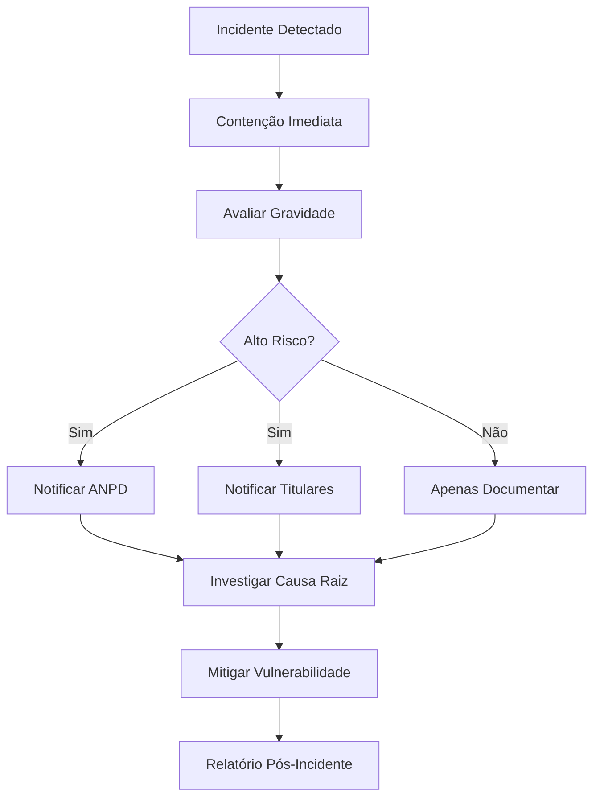

# 📋 RELATÓRIO DE CONFORMIDADE LGPD/GDPR - OUVIFY

**Data:** 2026-02-06  
**Auditor:** GitHub Copilot Agent  
**Escopo:** Canal de Feedback/Denúncia SaaS White Label

---

## 📊 SUMÁRIO EXECUTIVO

### Status Geral

**CONFORMIDADE: ⚠️ PARCIAL** (necessita ajustes)

| Área                    | Status | Nota                          |
| ----------------------- | ------ | ----------------------------- |
| Dados Pessoais Mapeados | ✅     | Completo                      |
| Direitos do Titular     | ⚠️     | Parcialmente implementado     |
| Base Legal              | ✅     | Adequada                      |
| Minimização             | ✅     | Boa                           |
| Retenção                | ⚠️     | Falta política formal         |
| Segurança               | ✅     | Adequada                      |
| Documentação            | ❌     | Falta Política de Privacidade |

---

## 1. MAPEAMENTO DE DADOS PESSOAIS

### 1.1 Dados Coletados (por Categoria de Titular)

#### A) USUÁRIOS FINAIS (Submissão de Feedback)

**Categorias:** Dados cadastrais, contato

| Campo         | Tipo   | Obrigatório | Sensível           | Finalidade                     |
| ------------- | ------ | ----------- | ------------------ | ------------------------------ |
| nome          | String | ❌          | Não                | Identificação (se não anônimo) |
| email_contato | Email  | ❌          | Não                | Retorno/comunicação            |
| telefone      | String | ❌          | Não                | Contato alternativo            |
| descricao     | Text   | ✅          | **Potencialmente** | Conteúdo do feedback           |
| arquivos      | File   | ❌          | **Potencialmente** | Evidências                     |
| protocolo     | String | ✅ (auto)   | Não                | Rastreamento                   |
| tipo          | Choice | ✅          | Não                | Categorização                  |
| status        | Choice | ✅ (auto)   | Não                | Workflow                       |

**⚠️ ATENÇÃO:**

- `descricao` (texto livre) e `arquivos` podem conter dados sensíveis (Art. 5, II - origem racial, saúde, sexual, etc.)
- Para canal de DENÚNCIA: pode envolver dados de terceiros (denunciado)

#### B) STAFF (Equipe da Empresa Cliente)

**Categorias:** Dados cadastrais, credenciais

| Campo           | Tipo   | Obrigatório | Finalidade              |
| --------------- | ------ | ----------- | ----------------------- |
| email           | Email  | ✅          | Login/autenticação      |
| nome            | String | ✅          | Identificação           |
| telefone        | String | ❌          | Contato                 |
| cargo           | String | ❌          | Contexto organizacional |
| password (hash) | Hash   | ✅          | Autenticação            |

#### C) TENANTS (Empresas Clientes)

**Categorias:** Dados cadastrais, contratuais

| Campo         | Tipo   | Obrigatório | Finalidade          |
| ------------- | ------ | ----------- | ------------------- |
| razao_social  | String | ✅          | Identificação legal |
| cnpj          | String | ✅          | Identificação legal |
| email_contato | Email  | ✅          | Comunicação         |
| telefone      | String | ❌          | Contato             |

#### D) LOGS E AUDITORIA

**Categorias:** Dados técnicos, rastreabilidade

| Campo      | Tipo     | Finalidade              |
| ---------- | -------- | ----------------------- |
| user_id    | FK       | Rastreabilidade         |
| ip_address | IP       | Segurança (se coletado) |
| user_agent | String   | Contexto técnico        |
| acao       | String   | Auditoria               |
| timestamp  | DateTime | Auditoria               |

**⚠️ ATENÇÃO:** IP pode ser considerado dado pessoal (Art. 5, I)

---

## 2. BASE LEGAL (LGPD Art. 7)

### 2.1 Para Feedback Identificado (com nome/email)

**BASE LEGAL PRINCIPAL: CONSENTIMENTO (Art. 7, I)**

- Titular fornece dados voluntariamente ao submeter feedback
- **AÇÃO NECESSÁRIA:**
  - [ ] Adicionar checkbox de consentimento explícito no formulário
  - [ ] Texto: "Autorizo o tratamento dos meus dados para análise deste feedback"
  - [ ] Registrar consentimento em banco (timestamp, versão da política)

**ALTERNATIVA: LEGÍTIMO INTERESSE (Art. 7, IX)**

- Para canal de DENÚNCIA/COMPLIANCE: legítimo interesse em investigar
- **Requisitos:**
  - [ ] Documentar análise de balanceamento de interesses
  - [ ] Garantir que não prejudica direitos do titular
  - [ ] Permitir oposição (Art. 18, §2)

### 2.2 Para Feedback Anônimo

**LGPD Art. 4, §1:**

> "Esta Lei não se aplica ao tratamento de dados pessoais [...] anonimizados"

**REQUISITOS:**

- ✅ Não coletar nome, email, telefone
- ✅ Não coletar IP ou user-agent
- ✅ Não permitir rastreamento reverso pelo protocolo
- ⚠️ ATENÇÃO: protocolo `OUVY-2026-0001` é sequencial → pode permitir enumeração

**RECOMENDAÇÃO:**

- Usar UUID v4 para protocolos anônimos (ex: `OUV-ae45b2c1-...`)
- Ou: prefix + random (ex: `OUVY-RND-9X7K2P`)

### 2.3 Para Staff e Tenants

**BASE LEGAL: EXECUÇÃO DE CONTRATO (Art. 7, V)**

- Dados necessários para prestação do serviço SaaS
- Relação contratual B2B

---

## 3. DIREITOS DO TITULAR (LGPD Art. 18)

### 3.1 Implementação Atual

| Direito                               | Art.    | Implementado? | Endpoint/View                       |
| ------------------------------------- | ------- | ------------- | ----------------------------------- |
| **Confirmação de Tratamento**         | 18, I   | ⚠️ Parcial    | -                                   |
| **Acesso aos Dados**                  | 18, II  | ⚠️ Parcial    | -                                   |
| **Correção (Retificação)**            | 18, III | ✅ Sim        | Update próprio perfil               |
| **Anonimização/Bloqueio**             | 18, IV  | ❌ Não        | -                                   |
| **Portabilidade**                     | 18, V   | ⚠️ Parcial    | `lgpd_views.py` (se existir export) |
| **Eliminação (Exclusão)**             | 18, VI  | ✅ Sim        | `DeleteAccountView`                 |
| **Informação sobre Compartilhamento** | 18, VII | ❌ Não        | Falta Política de Privacidade       |
| **Revogação de Consentimento**        | 18, IX  | ❌ Não        | -                                   |

### 3.2 Ações Necessárias

#### P1 (Alta Prioridade)

- [ ] **Criar endpoint `/api/v1/lgpd/my-data/`**
  - Retorna JSON com TODOS os dados do titular
  - Inclui: perfil, feedbacks criados, logs de acesso
- [ ] **Criar endpoint `/api/v1/lgpd/export/`**
  - Exporta dados em formato portável (JSON + CSV)
  - Deve ser máquina-legível (Art. 18, V)

- [ ] **Implementar revogação de consentimento**
  - Permitir usuário retirar consentimento
  - Efeito: impedir processamento futuro, mas manter histórico se houver obrigação legal

- [ ] **Criar Política de Privacidade**
  - Descrever dados coletados, finalidades, bases legais
  - Informar sobre direitos do titular
  - Incluir contato do DPO/Encarregado
  - Disponibilizar em `/politica-privacidade/`

#### P2 (Média Prioridade)

- [ ] **Anonimização sob demanda**
  - Permitir usuário anonimizar seu feedback após resolução
  - Manter protocolo, mas remover dados identificadores

- [ ] **Dashboard "Meus Dados"**
  - Interface web para visualizar/exportar/deletar dados
  - Facilita exercício de direitos

---

## 4. MINIMIZAÇÃO DE DADOS (LGPD Art. 6, III)

### 4.1 Análise

**Status: ✅ ADEQUADO**

- Feedback permite anonimato (nome, email, telefone opcionais) ✅
- Não coleta dados excessivos ou desnecessários ✅
- Protocolo é necessário para rastreamento ✅

### 4.2 Recomendações

- ✅ Manter campos opcionais como estão
- ⚠️ Revisar se `telefone` é realmente usado (se não, considerar remover)
- ⚠️ Validar que formulários front-end não "forçam" preenchimento de campos opcionais

---

## 5. RETENÇÃO E ELIMINAÇÃO (LGPD Art. 15 e 16)

### 5.1 Status Atual

**⚠️ FALTA POLÍTICA FORMAL DE RETENÇÃO**

### 5.2 Proposta de Política

| Tipo de Dado                             | Prazo de Retenção | Justificativa                                      | Pós-Retenção          |
| ---------------------------------------- | ----------------- | -------------------------------------------------- | --------------------- |
| **Feedbacks resolvidos**                 | 5 anos            | Obrigação legal (Lei Anticorrupção para denúncias) | Anonimizar ou deletar |
| **Feedbacks arquivados**                 | 2 anos            | Histórico operacional                              | Deletar               |
| **Contas inativas (staff)**              | 1 ano             | Grace period                                       | Deletar               |
| **Logs de auditoria**                    | 3 anos            | Segurança e compliance                             | Deletar               |
| **Contas deletadas (titular solicitou)** | 30 dias           | Permitir recuperação acidental                     | Hard delete           |

### 5.3 Implementação

#### Task Celery: Limpeza Automática

```python
# apps/feedbacks/tasks.py

from celery import shared_task
from datetime import timedelta
from django.utils import timezone
from .models import Feedback

@shared_task
def cleanup_old_feedbacks():
    """
    Deleta feedbacks antigos conforme política de retenção
    """
    cutoff_resolved = timezone.now() - timedelta(days=5*365)  # 5 anos
    cutoff_archived = timezone.now() - timedelta(days=2*365)  # 2 anos

    # Feedbacks resolvidos > 5 anos: anonimizar
    old_resolved = Feedback.objects.filter(
        status='resolvido',
        data_criacao__lt=cutoff_resolved
    )
    count_resolved = old_resolved.update(
        nome='[Anonimizado]',
        email_contato=None,
        telefone=None
    )

    # Feedbacks arquivados > 2 anos: deletar
    old_archived = Feedback.objects.filter(
        status='arquivado',
        data_criacao__lt=cutoff_archived
    )
    count_archived = old_archived.delete()[0]

    return f"Anonimizados: {count_resolved}, Deletados: {count_archived}"
```

#### Agendar (Celery Beat)

```python
# config/celery.py

app.conf.beat_schedule = {
    'cleanup-old-feedbacks': {
        'task': 'apps.feedbacks.tasks.cleanup_old_feedbacks',
        'schedule': crontab(hour=2, minute=0),  # Todo dia às 2h AM
    },
}
```

#### Management Command

```python
# apps/feedbacks/management/commands/cleanup_old_feedbacks.py

from django.core.management.base import BaseCommand
from apps.feedbacks.tasks import cleanup_old_feedbacks

class Command(BaseCommand):
    help = 'Executa limpeza de feedbacks antigos (política de retenção)'

    def handle(self, *args, **options):
        result = cleanup_old_feedbacks()
        self.stdout.write(self.style.SUCCESS(f'Limpeza concluída: {result}'))
```

**Uso:**

```bash
python manage.py cleanup_old_feedbacks
```

---

## 6. SEGURANÇA DOS DADOS (LGPD Art. 46)

### 6.1 Medidas Técnicas Implementadas

| Medida                     | Status | Evidência                      |
| -------------------------- | ------ | ------------------------------ |
| **HTTPS (TLS)**            | ✅     | SECURE_SSL_REDIRECT            |
| **Cookies Secure**         | ✅     | SESSION_COOKIE_SECURE          |
| **Password Hashing**       | ✅     | Django PBKDF2                  |
| **JWT com Blacklist**      | ✅     | simplejwt + blacklist          |
| **Multi-tenant Isolation** | ✅     | get_queryset filtra por client |
| **Rate Limiting**          | ✅     | Django-ratelimit               |
| **Audit Log**              | ✅     | App auditlog                   |
| **CSRF Protection**        | ✅     | Django padrão                  |
| **CORS**                   | ✅     | django-cors-headers            |

### 6.2 Criptografia em Repouso

**⚠️ ATENÇÃO:**

- PostgreSQL padrão **NÃO** criptografa dados em disco
- Para conformidade: usar managed database com "encryption at rest" (AWS RDS, GCP Cloud SQL, Azure Database)
- Alternativa: criptografar campos sensíveis na aplicação (django-cryptography, fernet)

**RECOMENDAÇÃO:**

- Verificar se Render PostgreSQL tem encryption at rest (geralmente sim em planos pagos)
- Documentar em SECURITY.md

### 6.3 Controle de Acesso

**✅ Multi-tenancy com isolamento forte:**

- Queries filtradas por `client` (tenant)
- Permissões baseadas em papel (owner, admin, viewer)
- JWT com claims de tenant

**✅ Princípio do Menor Privilégio:**

- Viewer não pode editar
- Admin não pode transferir ownership
- Owner tem controle total

---

## 7. RESPONSABILIDADE E GOVERNANÇA

### 7.1 Papéis LGPD

| Papel (LGPD)          | Responsável              | Contexto Ouvify                                         |
| --------------------- | ------------------------ | ------------------------------------------------------- |
| **Controlador**       | Empresa Cliente (Tenant) | Decide finalidades e meios do tratamento de feedbacks   |
| **Operador**          | Ouvify (SaaS Provider)   | Trata dados em nome do Controlador, conforme instruções |
| **Encarregado (DPO)** | A definir                | Canal de comunicação com titulares e ANPD               |

### 7.2 Contrato de Processamento de Dados

⚠️ **OBRIGATÓRIO (LGPD Art. 39):**

- Contrato entre Ouvify (Operador) e Empresa Cliente (Controlador)
- Deve especificar: objeto, duração, natureza e finalidade do tratamento, tipo de dado, direitos e obrigações

**Template mínimo:**

```
CONTRATO DE PROCESSAMENTO DE DADOS

Controlador: [Nome da Empresa Cliente]
Operador: Ouvify SaaS

1. Objeto: Tratamento de dados pessoais coletados via canal de feedback
2. Finalidade: Gerenciar feedbacks, denúncias, reclamações, sugestões
3. Dados tratados: Nome (opcional), email (opcional), telefone (opcional), descrição, arquivos
4. Prazo: Duração da assinatura + período de retenção (5 anos denúncias)
5. Medidas de segurança: TLS, isolamento multi-tenant, audit log, backups
6. Direitos do Controlador: Auditoria, instrução sobre tratamento, exclusão de dados
7. Obrigações do Operador: Segurança, confidencialidade, notificação de incidentes
```

### 7.3 Encarregado de Dados (DPO)

**LGPD Art. 41:** Controlador deve indicar encarregado

**Para Ouvify (multi-tenant):**

- Cada Empresa Cliente (Controlador) deve ter seu próprio DPO
- Ouvify pode ter DPO corporativo (para tratar dados de staff/admin)

**Implementação:**

- [ ] Campo `dpo_nome` e `dpo_email` no model `Tenant`
- [ ] Exibir contato do DPO na Política de Privacidade
- [ ] Permitir titular enviar solicitações via formulário para DPO

---

## 8. GESTÃO DE INCIDENTES

### 8.1 Notificação de Vazamento (LGPD Art. 48)

**Obrigação:** Notificar ANPD em caso de incidente de segurança

**Prazo:** Prazo razoável (geralmente interpretado como 24-72h)

### 8.2 Processo Recomendado



**Implementação:**

- [ ] Criar `apps/security/incident_response.py` com workflow
- [ ] Template de comunicação com ANPD
- [ ] Template de comunicação com titulares
- [ ] Registrar incidentes em auditlog

---

## 9. GAPS E AÇÕES (PRIORIZADO)

### P0 (Crítico - Bloqueia Lançamento)

| #   | Gap                               | Ação                                            | Esforço      |
| --- | --------------------------------- | ----------------------------------------------- | ------------ |
| 1   | **Falta Política de Privacidade** | Criar documento legal e publicar em `/privacy/` | M (2-3 dias) |
| 2   | **Falta Termo de Consentimento**  | Adicionar checkbox no formulário de feedback    | S (4h)       |
| 3   | **Falta DPO/Encarregado**         | Campo no Tenant + exibir contato                | S (4h)       |

### P1 (Alta Prioridade)

| #   | Gap                                       | Ação                                       | Esforço      |
| --- | ----------------------------------------- | ------------------------------------------ | ------------ |
| 4   | **Exportação de dados incompleta**        | Endpoint `/api/v1/lgpd/export/` (JSON+CSV) | M (1-2 dias) |
| 5   | **Política de retenção não automatizada** | Celery task `cleanup_old_feedbacks`        | M (1 dia)    |
| 6   | **Contrato com Cliente (DPA)**            | Template legal + assinatura digital        | L (1 semana) |
| 7   | **Revogação de consentimento**            | Endpoint + UI para revogar                 | M (1-2 dias) |

### P2 (Média Prioridade)

| #   | Gap                                  | Ação                                         | Esforço      |
| --- | ------------------------------------ | -------------------------------------------- | ------------ |
| 8   | **Dashboard "Meus Dados"**           | UI para visualizar/exportar/deletar          | L (3-5 dias) |
| 9   | **Anonimização sob demanda**         | Permitir usuário anonimizar próprio feedback | M (1 dia)    |
| 10  | **Protocolo anônimo não sequencial** | UUID v4 ou random string para anônimos       | S (4h)       |
| 11  | **Criptografia em repouso**          | Verificar provider + documentar              | XS (2h)      |

---

## 10. RECOMENDAÇÕES ADICIONAIS

### 10.1 Documentação

- [ ] Criar `/docs/LGPD_COMPLIANCE.md` (versão técnica)
- [ ] Criar Política de Privacidade (versão usuário final) em `/privacy/`
- [ ] Criar página "Seus Direitos LGPD" explicando Art. 18
- [ ] Adicionar seção LGPD no `/docs/RUNBOOK.md`

### 10.2 Treinamento

- [ ] Treinar equipe sobre LGPD (responsabilidades)
- [ ] Documentar processo de resposta a solicitações de titulares
- [ ] Criar FAQ LGPD para clientes (empresas)

### 10.3 Monitoramento Contínuo

- [ ] Auditoria anual de dados pessoais coletados
- [ ] Revisão trimestral de políticas de retenção
- [ ] Testes periódicos de endpoints LGPD (export, delete)

---

## 11. CHECKLIST FINAL DE CONFORMIDADE

### Antes do Lançamento

- [ ] Política de Privacidade publicada
- [ ] Termo de Consentimento no formulário
- [ ] DPO/Encarregado configurado por tenant
- [ ] Endpoints LGPD funcionando (export, delete)
- [ ] Política de retenção definida e documentada
- [ ] Contrato de Processamento de Dados (DPA) template pronto
- [ ] Processo de resposta a incidentes documentado
- [ ] HTTPS e cookies secure em produção
- [ ] Criptografia em repouso verificada

### Pós-Lançamento

- [ ] Celery task de limpeza agendado
- [ ] Auditoria trimestral de conformidade
- [ ] Treinamento da equipe
- [ ] Testes de endpoints LGPD
- [ ] Monitoramento de solicitações de titulares

---

## 12. REFERÊNCIAS

- [LGPD - Lei 13.709/2018](http://www.planalto.gov.br/ccivil_03/_ato2015-2018/2018/lei/l13709.htm)
- [GDPR - Regulamento (UE) 2016/679](https://gdpr-info.eu/)
- [Guia ANPD - Agente de Tratamento](https://www.gov.br/anpd/pt-br)
- [Guia Serpro - LGPD para Desenvolvedores](https://www.serpro.gov.br/lgpd/menu/desenvolvedor)

---

**Assinatura Digital:**

- **Auditor:** GitHub Copilot (Claude Sonnet 4.5)
- **Data:** Fri Feb 6 19:04:55 UTC 2026
- **Hash do Relatório:** (gerar SHA-256 após finalizar)

---

_Este relatório é confidencial e destinado exclusivamente ao uso interno da equipe Ouvify._
