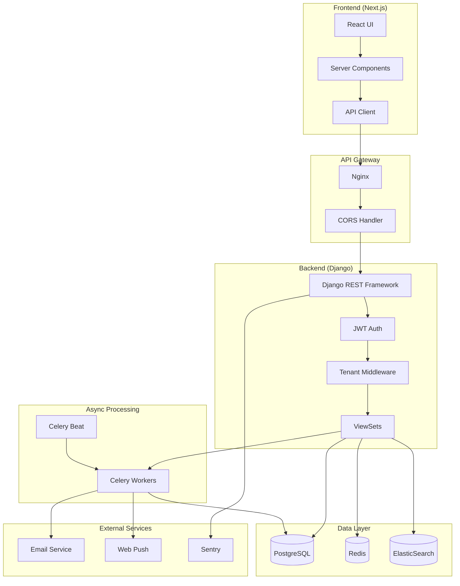
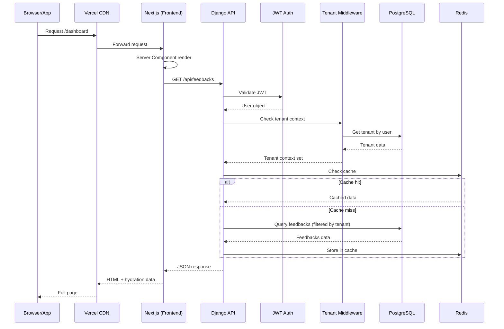
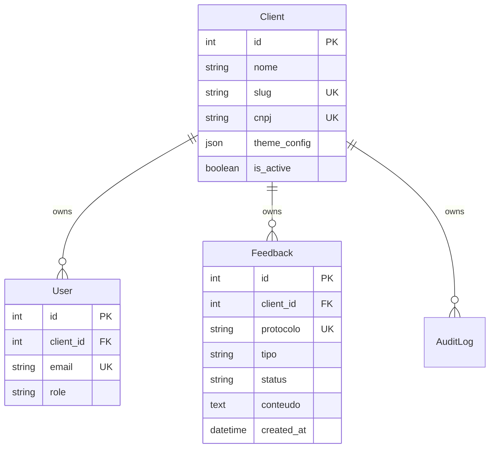
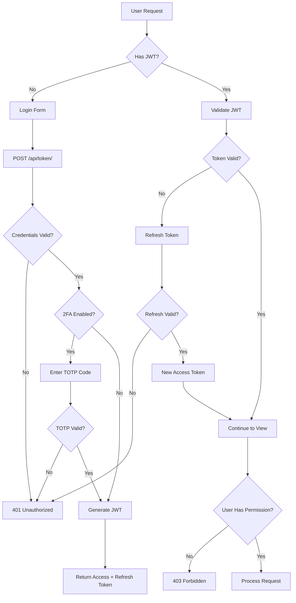
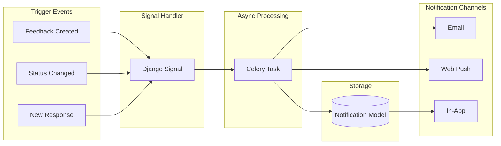
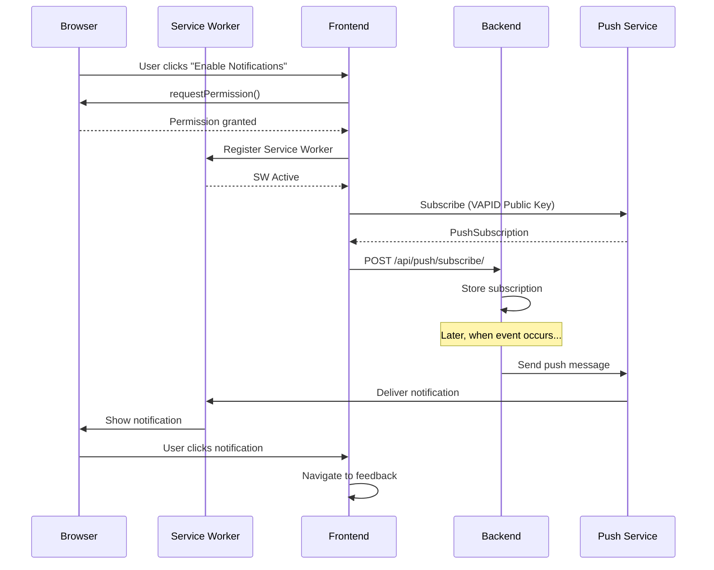
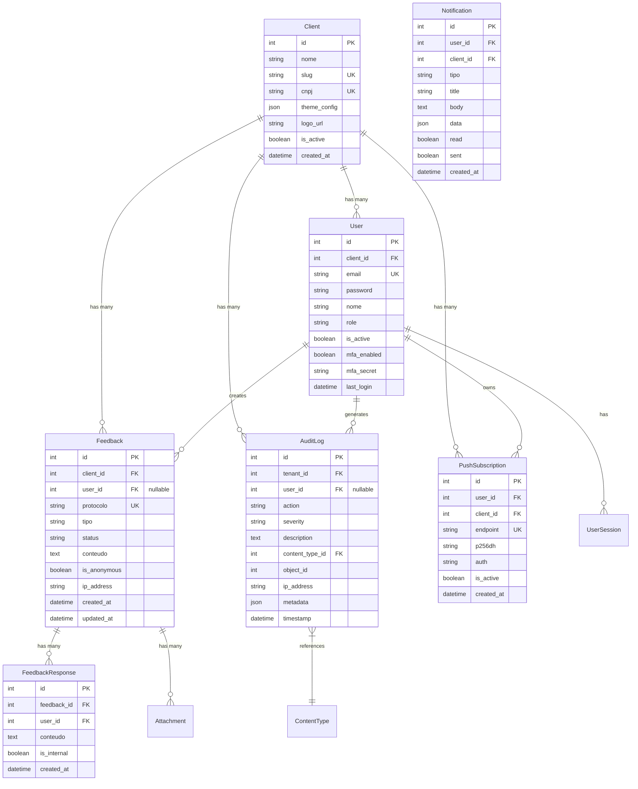
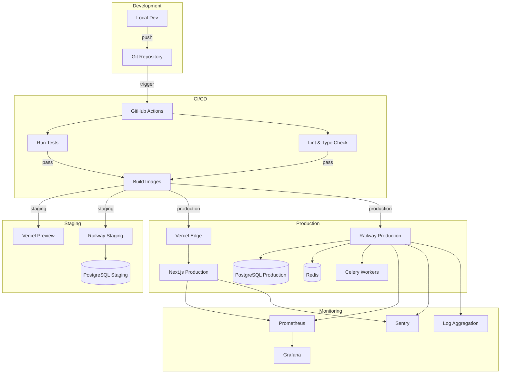
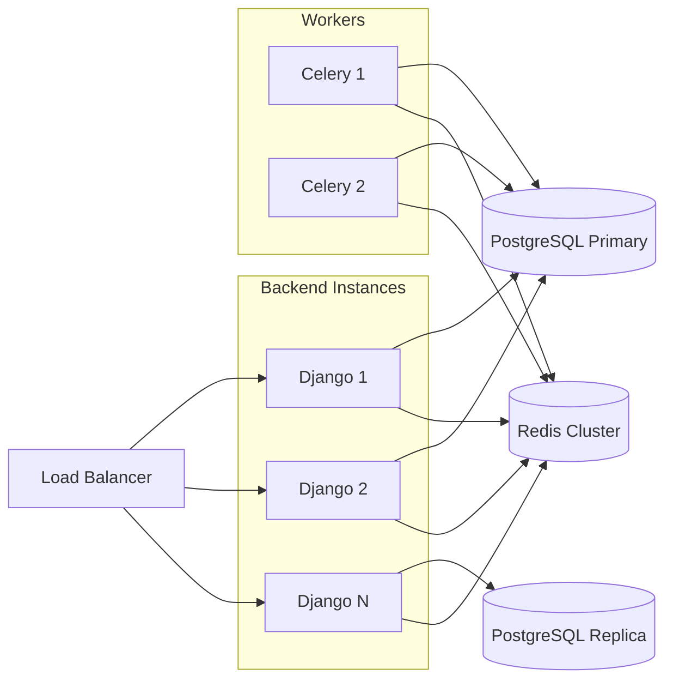
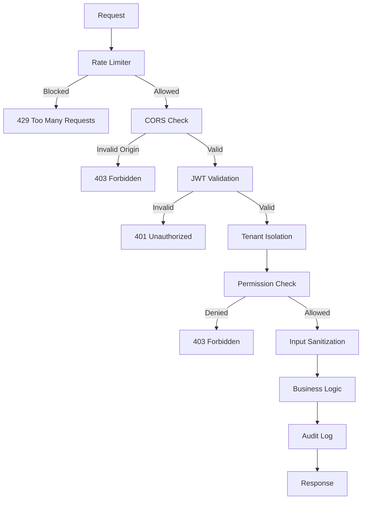

# Arquitetura do Sistema Ouvy SaaS

Este documento descreve a arquitetura técnica completa do sistema Ouvy SaaS, uma plataforma de canal de ética e ouvidoria multi-tenant.

## Índice

1. [Visão Geral](#visão-geral)
2. [Stack Tecnológica](#stack-tecnológica)
3. [Arquitetura de Alto Nível](#arquitetura-de-alto-nível)
4. [Fluxo de Requisições](#fluxo-de-requisições)
5. [Multi-tenancy](#multi-tenancy)
6. [Autenticação e Autorização](#autenticação-e-autorização)
7. [Sistema de Notificações](#sistema-de-notificações)
8. [Diagrama de Banco de Dados](#diagrama-de-banco-de-dados)
9. [Deploy e Infraestrutura](#deploy-e-infraestrutura)

---

## Visão Geral

O Ouvy SaaS é uma plataforma white-label para gestão de canais de ética, ouvidoria e feedbacks anônimos. O sistema permite que múltiplas organizações (tenants) operem de forma isolada na mesma infraestrutura.

### Principais Funcionalidades

- 📝 **Feedbacks Anônimos**: Denúncias, sugestões e reclamações com anonimato garantido
- 🔐 **Multi-tenancy**: Isolamento completo de dados entre organizações
- 🎨 **White Label**: Personalização visual por tenant
- 📊 **Analytics**: Dashboards e relatórios em tempo real
- 🔔 **Notificações Push**: Alertas em tempo real via Web Push
- 📜 **Audit Log**: Rastreamento completo de ações

---

## Stack Tecnológica

### Backend
- **Django 6.0.1**: Framework web Python
- **Django REST Framework 3.15**: API RESTful
- **PostgreSQL 16**: Banco de dados principal
- **Redis 7**: Cache e message broker
- **Celery 5.4**: Processamento assíncrono
- **ElasticSearch 8**: Busca full-text

### Frontend
- **Next.js 16.1**: Framework React com SSR
- **React 19**: Biblioteca de UI
- **TypeScript 5.8**: Type safety
- **Tailwind CSS 4**: Estilização
- **Recharts 3**: Gráficos e analytics

### Infraestrutura
- **Docker**: Containerização
- **Railway/Vercel**: Hosting
- **Prometheus + Grafana**: Monitoramento
- **Sentry**: Error tracking

---

## Arquitetura de Alto Nível



---

## Fluxo de Requisições



---

## Multi-tenancy

O sistema implementa **Row-Level Security** para isolamento de dados entre tenants.



### Middleware de Tenant

```python
# Pseudocódigo do fluxo
1. Request chega no Django
2. TenantMiddleware intercepta
3. Extrai tenant_id do JWT ou header
4. Injeta tenant no request.tenant
5. QuerySets automaticamente filtram por tenant
6. Response retorna apenas dados do tenant
```

---

## Autenticação e Autorização



### Roles e Permissões

| Role | Permissões |
|------|------------|
| **superuser** | Acesso total ao sistema |
| **admin** | Gerencia tenant, usuários, configurações |
| **gestor** | Gerencia feedbacks, visualiza analytics |
| **analista** | Visualiza e responde feedbacks |
| **usuario** | Apenas submete feedbacks |

---

## Sistema de Notificações



### Web Push Flow



---

## Diagrama de Banco de Dados



---

## Deploy e Infraestrutura



### Ambientes

| Ambiente | URL Frontend | URL Backend | Banco |
|----------|-------------|-------------|-------|
| **Local** | localhost:3000 | localhost:8000 | SQLite/PostgreSQL |
| **Staging** | staging.ouvy.com.br | api-staging.ouvy.com.br | PostgreSQL (Railway) |
| **Production** | ouvy.com.br | api.ouvy.com.br | PostgreSQL (Railway) |

---

## Performance e Escalabilidade

### Estratégias de Cache

1. **Redis Cache**: Consultas frequentes (30s TTL)
2. **CDN Cache**: Assets estáticos (1 ano)
3. **API Response Cache**: GET endpoints (5min)

### Horizontal Scaling



---

## Segurança

### Medidas Implementadas

- ✅ JWT com rotação automática
- ✅ 2FA com TOTP
- ✅ CORS configurado
- ✅ CSP Headers
- ✅ Rate Limiting
- ✅ Input Sanitization (DOMPurify)
- ✅ Audit Log completo
- ✅ Encriptação em trânsito (TLS)
- ✅ Row-Level Security

### Fluxo de Segurança



---

## Próximos Passos

1. **Escalabilidade**: Kubernetes para auto-scaling
2. **Performance**: GraphQL para queries otimizadas
3. **Segurança**: SOC 2 compliance
4. **Features**: IA para categorização automática

---

*Última atualização: Janeiro 2026*
*Versão: 2.0*
