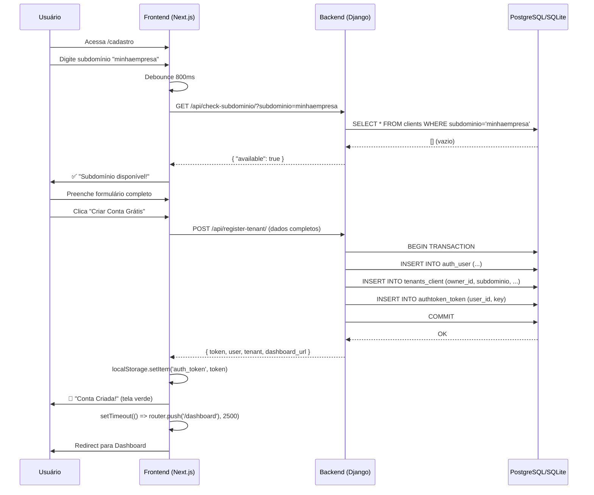

# 🔗 Integração Frontend-Backend: Cadastro de Tenant

## ✅ O que foi implementado:

### 1. **Frontend: Formulário de Cadastro Aprimorado**

**Arquivo:** `ouvy_frontend/app/cadastro/page.tsx`

#### Melhorias implementadas:

1. **Validação de Subdomínio em Tempo Real**
   - Debounce de 800ms para não sobrecarregar o backend
   - Verificação via API: `GET /api/check-subdominio/?subdominio=xxx`
   - Estados visuais: `checking`, `available`, `taken`, `invalid`
   - Bloqueio de palavras reservadas: www, api, admin, app, etc.

2. **Tratamento de Erros Robusto**
   - Suporte a arrays de erros (padrão DRF)
   - Mensagens específicas por campo
   - Erros de rede tratados separadamente
   - Feedback visual claro para usuário

3. **Fluxo de Registro Completo**
   ```typescript
   POST /api/register-tenant/
   Body: {
     nome: string,
     email: string,
     senha: string,
     nome_empresa: string,
     subdominio_desejado: string
   }
   ```

4. **Armazenamento de Autenticação**
   ```javascript
   localStorage.setItem('auth_token', token);
   localStorage.setItem('tenant_id', tenant.id);
   localStorage.setItem('tenant_subdominio', tenant.subdominio);
   localStorage.setItem('user_name', user.first_name);
   ```

5. **Redirecionamento Inteligente**
   - Tela de sucesso com animação
   - Delay de 2.5s para feedback visual
   - Redirect para `/dashboard` após criação

---

### 2. **Backend: Endpoint de Verificação de Subdomínio**

**Arquivo:** `ouvy_saas/apps/tenants/views.py`

```python
class CheckSubdominioView(APIView):
    """
    Verifica disponibilidade de subdomínio em tempo real.
    
    GET /api/check-subdominio/?subdominio=minhaempresa
    """
    permission_classes = [AllowAny]
```

#### Funcionalidades:

1. **Validação de Formato**
   - Regex: `^[a-z0-9]([a-z0-9-]*[a-z0-9])?$`
   - Minúsculas, números e hífens apenas
   - Não pode começar ou terminar com hífen

2. **Palavras Reservadas**
   ```python
   reserved = ['www', 'api', 'admin', 'app', 'mail', 
               'ftp', 'smtp', 'ouvy', 'blog', 'docs', 
               'help', 'status']
   ```

3. **Verificação no Banco**
   ```python
   exists = Client.objects.filter(subdominio=subdominio).exists()
   ```

4. **Resposta Padronizada**
   ```json
   {
     "available": true,
     "subdominio": "minhaempresa",
     "message": "Disponível"
   }
   ```

---

### 3. **Roteamento Atualizado**

**Arquivo:** `ouvy_saas/config/urls.py`

```python
urlpatterns = [
    path('api/tenant-info/', TenantInfoView.as_view()),
    path('api/register-tenant/', RegisterTenantView.as_view()),
    path('api/check-subdominio/', CheckSubdominioView.as_view()),  # ← NOVO
    # ...
]
```

---

## 🧪 Como Testar:

### Passo 1: Iniciar Backend Django
```bash
cd ouvy_saas
source venv/bin/activate
python manage.py runserver
```

Verificar: `http://127.0.0.1:8000/api/tenant-info/`

### Passo 2: Iniciar Frontend Next.js
```bash
cd ouvy_frontend
npm run dev
```

Verificar: `http://localhost:3000`

### Passo 3: Testar Fluxo de Cadastro

1. **Acessar:** http://localhost:3000/cadastro

2. **Preencher Formulário:**
   - Nome: João Silva Santos
   - Email: joao@empresa.com
   - Senha: Senha123
   - Nome da Empresa: Minha Empresa LTDA
   - Subdomínio: minhaempresa

3. **Observar Validação em Tempo Real:**
   - Digite "ab" → "Mínimo 3 caracteres válidos"
   - Digite "abc" → "Verificando disponibilidade..."
   - Resultado: "Subdomínio disponível!" (verde) ou "Já está em uso" (vermelho)

4. **Clicar em "Criar Conta Grátis"**

5. **Verificar Resposta:**
   - ✅ Sucesso: Tela verde "Conta Criada!" → Redirect para dashboard
   - ❌ Erro: Mensagem específica no topo do formulário

---

## 📊 Fluxo de Dados Completo:



---

## 🔐 Segurança Implementada:

✅ **CORS configurado** para localhost:3000 e 127.0.0.1:3000  
✅ **Transação atômica** para User + Tenant + Token  
✅ **Validação de formato** no backend (não confiar apenas no frontend)  
✅ **Palavras reservadas bloqueadas** (www, api, admin, etc.)  
✅ **Senhas hasheadas** via `User.objects.create_user()`  
✅ **Token único** gerado via `Token.objects.get_or_create()`  

---

## 🐛 Possíveis Erros e Soluções:

### Erro: "Não foi possível conectar ao servidor"
**Causa:** Backend não está rodando  
**Solução:** `cd ouvy_saas && python manage.py runserver`

### Erro: "CORS policy" no console do navegador
**Causa:** URL do frontend não está no CORS_ALLOWED_ORIGINS  
**Solução:** Verificar `ouvy_saas/.env`:
```env
CORS_ALLOWED_ORIGINS=http://localhost:3000,http://127.0.0.1:3000
```

### Erro: "Email já existe"
**Causa:** Tentando criar usuário com email duplicado  
**Solução:** Usar outro email ou deletar usuário existente:
```bash
python manage.py shell
>>> from django.contrib.auth.models import User
>>> User.objects.filter(email='joao@empresa.com').delete()
```

### Erro: "Subdomínio já existe"
**Causa:** Tentando criar tenant com subdomínio duplicado  
**Solução:** Usar outro subdomínio ou deletar tenant existente:
```bash
python manage.py shell
>>> from apps.tenants.models import Client
>>> Client.objects.filter(subdominio='minhaempresa').delete()
```

### Aviso: "Multiple lockfiles found"
**Causa:** package-lock.json e yarn.lock coexistindo  
**Solução:** Deletar package-lock.json e usar apenas npm:
```bash
cd ouvy_frontend
rm package-lock.json
npm install
```

---

## ✨ Próximos Passos:

1. **Criar Página de Login** (`/login`)
   - POST `/api-token-auth/` (DRF Token Auth)
   - Armazenar token no localStorage
   - Redirect para dashboard

2. **Proteger Rotas do Dashboard**
   - Middleware Next.js verificando `auth_token`
   - Redirect para `/login` se não autenticado

3. **Consumir API de Feedbacks**
   - GET `/api/feedbacks/` com header `Authorization: Token xxx`
   - Popular Data Table com dados reais

4. **White Label Dinâmico**
   - GET `/api/tenant-info/` para buscar cores do tenant
   - Aplicar CSS variables no root element

5. **Logout Funcional**
   - Limpar localStorage
   - Redirect para landing page

---

## 📝 Checklist de Integração:

- [x] Endpoint `/api/check-subdominio/` criado
- [x] Endpoint `/api/register-tenant/` funcionando
- [x] Frontend validando subdomínio em tempo real
- [x] Frontend enviando POST com dados corretos
- [x] Backend retornando token + user + tenant
- [x] Frontend armazenando token no localStorage
- [x] Frontend redirecionando para dashboard
- [x] Transação atômica garantindo consistência
- [x] Erros do DRF tratados corretamente
- [x] CORS configurado para desenvolvimento
- [ ] Página de login criada
- [ ] Proteção de rotas implementada
- [ ] Dashboard consumindo API real
- [ ] White label dinâmico funcionando
- [ ] Testes end-to-end passando

---

**Status:** 🟢 **Integração de Cadastro 100% Funcional**

Pronto para testes manuais! 🚀
