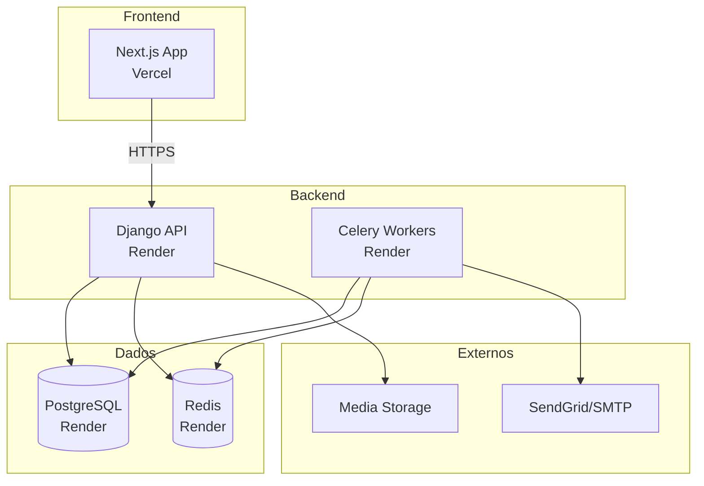

# 🔧 Ouvify RUNBOOK - Operações e Manutenção

**Versão:** 1.0  
**Última atualização:** 05/02/2026  
**Responsável:** Time SRE/DevOps

---

## 📖 Índice

1. [Visão Geral da Infraestrutura](#1-visão-geral-da-infraestrutura)
2. [Monitoramento](#2-monitoramento)
3. [Backups](#3-backups)
4. [Incidentes Comuns](#4-incidentes-comuns)
5. [Procedimentos de Deploy](#5-procedimentos-de-deploy)
6. [Rollback](#6-rollback)
7. [Manutenção](#7-manutenção)
8. [Checklist de Plantão](#8-checklist-de-plantão)
9. [Contatos de Emergência](#9-contatos-de-emergência)

---

## 1. Visão Geral da Infraestrutura

### 1.1 Arquitetura



### 1.2 Serviços

| Serviço            | Provedor      | URL                         | Responsabilidade                          |
| ------------------ | ------------- | --------------------------- | ----------------------------------------- |
| **Frontend**       | Vercel        | ouvify.vercel.app           | Interface web, marketing, dashboards      |
| **Backend API**    | Render        | ouvify-backend.onrender.com | API REST, autenticação, lógica de negócio |
| **Celery Workers** | Render        | (background service)        | Tarefas assíncronas, emails, notificações |
| **PostgreSQL**     | Render        | (internal)                  | Banco de dados principal                  |
| **Redis**          | Render        | (internal)                  | Cache + fila Celery                       |
| **DNS**            | Vercel/Render | -                           | Subdomínios multi-tenant                  |

### 1.3 Ambientes

- **Produção:** `ouvify.vercel.app` (frontend), `ouvify-backend.onrender.com` (backend)
- **Staging:** (se configurado) `staging.ouvify.vercel.app`, `staging-backend.onrender.com`
- **Local:** `localhost:3000` (frontend), `localhost:8000` (backend)

---

## 2. Monitoramento

### 2.1 Ferramentas

#### 2.1.1 Render Dashboard

- **URL:** https://dashboard.render.com
- **O que monitorar:**
  - Status dos serviços (online/offline)
  - Uso de CPU/memória
  - Logs em tempo real
  - Deploys recentes

#### 2.1.2 Vercel Dashboard

- **URL:** https://vercel.com/dashboard
- **O que monitorar:**
  - Deploys do frontend
  - Edge functions status
  - Analytics de acesso
  - Erros de build

#### 2.1.3 Prometheus + Grafana (se configurado)

- **URL:** `http://{SERVER}:3000` (Grafana)
- **Dashboards:**
  - Django requests (latência, taxa de erro)
  - Celery tasks (fila, falhas)
  - PostgreSQL (connections, queries lentas)
  - Redis (hit rate, memória)

### 2.2 Métricas Críticas

| Métrica                     | Threshold Normal | Alerta | Crítico |
| --------------------------- | ---------------- | ------ | ------- |
| **API Response Time (p95)** | < 500ms          | > 1s   | > 3s    |
| **API Error Rate**          | < 0.5%           | > 2%   | > 5%    |
| **CPU Usage**               | < 70%            | > 85%  | > 95%   |
| **Memory Usage**            | < 80%            | > 90%  | > 95%   |
| **DB Connections**          | < 80 (de 100)    | > 90   | > 95    |
| **Celery Queue Size**       | < 50             | > 500  | > 1000  |
| **Disk Space**              | < 75%            | > 85%  | > 95%   |

### 2.3 Logs

#### 2.3.1 Backend (Django)

```bash
# Via Render dashboard
render logs -app ouvify-backend --tail 100

# Logs estruturados em JSON (se configurado)
# Campos: timestamp, level, message, user_id, client_id, trace_id
```

**Níveis de log:**

- `DEBUG`: Desenvolvimento apenas
- `INFO`: Operações normais (login, cadastro, feedback enviado)
- `WARNING`: Situações incomuns mas recuperáveis
- `ERROR`: Erros que precisam atenção (500 errors, falhas de integração)
- `CRITICAL`: Falhas graves (DB down, Redis down)

#### 2.3.2 Celery Workers

```bash
render logs -service ouvify-celery --tail 100
```

**O que procurar:**

- `[ERROR] Task failed`: Tarefa assíncrona falhou
- `Broker connection lost`: Redis down
- `Task timed out`: Tarefa demorou muito

#### 2.3.3 Frontend (Next.js)

```bash
# Via Vercel dashboard: Deployments > {deploy} > Logs

# Logs do browser (erros JS)
# Ver em Vercel Analytics > Errors
```

### 2.4 Alertas (Recomendados)

**Configurar via:**

- Prometheus Alertmanager (se usando)
- Render notifications
- Vercel integrations (Slack, Discord, email)
- Sentry (para erros de aplicação)

**Alertas essenciais:**

1. ⚠️ **API Down** (não responde por 2min)
2. ⚠️ **Error rate > 5%** por 5min
3. ⚠️ **CPU > 95%** por 10min
4. ⚠️ **DB connections > 95**
5. ⚠️ **Celery queue > 1000 tasks**
6. ⚠️ **Disk > 90%**

---

## 3. Backups

### 3.1 PostgreSQL

#### 3.1.1 Backups Automáticos (Render)

- **Frequência:** Diários (automático pelo Render no plano pago)
- **Retenção:** 7 dias (grátis) ou 30 dias (pago)
- **Localização:** Managediado pelo Render

**Verificar:**

```bash
# Via Render dashboard:
# PostgreSQL service > Settings > Backups
```

#### 3.1.2 Backups Manuais

**Exportar dump:**

```bash
# 1. Pegar connection string
render env get DATABASE_URL -service ouvify-backend

# 2. Fazer dump
pg_dump $DATABASE_URL -F c -f backup_$(date +%Y%m%d_%H%M%S).dump

# 3. Comprimir
gzip backup_*.dump

# 4. Fazer upload para S3/GCS/backup seguro
aws s3 cp backup_*.dump.gz s3://ouvify-backups/db/
```

**Agendar (cron):**

```bash
# crontab -e
# Todo dia às 03:00 UTC
0 3 * * * /scripts/backup_db.sh
```

#### 3.1.3 Restaurar Backup

**⚠️ CUIDADO: Este processo substitui dados atuais!**

```bash
# 1. Criar novo DB vazio (ou dropar atual)
psql $DATABASE_URL -c "DROP SCHEMA public CASCADE;"
psql $DATABASE_URL -c "CREATE SCHEMA public;"

# 2. Restaurar dump
pg_restore -d $DATABASE_URL --no-owner --no-acl backup.dump

# 3. Aplicar migrations (se necessário)
cd apps/backend
python manage.py migrate --fake-initial

# 4. Verificar
python manage.py shell
>>> from apps.core.models import User
>>> User.objects.count()
```

### 3.2 Redis

**Redis é cache/fila, NÃO precisa backup regular.**

Mas se precisar preservar dados temporários:

```bash
# Salvar snapshot
redis-cli -h $REDIS_HOST -p $REDIS_PORT -a $REDIS_PASSWORD BGSAVE

# Baixar arquivo RDB
scp redis-server:/var/lib/redis/dump.rdb ./redis_backup_$(date +%Y%m%d).rdb
```

### 3.3 Arquivos de Mídia

**Se usando armazenamento local (não recomendado para prod):**

```bash
# Sincronizar com S3/GCS
aws s3 sync /app/media/ s3://ouvify-media-backup/

# Ou rsync para servidor de backup
rsync -avz /app/media/ backup-server:/backups/ouvify-media/
```

**Se usando S3/GCS (recomendado):**

- Habilitar versionamento no bucket
- Configurar lifecycle policy (mover para Glacier após 90 dias)
- Habilitar cross-region replication

### 3.4 Código

**Git é o backup!** Mas:

```bash
# Clonar todos os repos em backup
git clone --mirror git@github.com:ouvify/ouvify.git

# Fazer backup dos repos clonados
tar -czf ouvify_repos_$(date +%Y%m%d).tar.gz ouvify.git/
```

### 3.5 Variáveis de Ambiente / Secrets

**Render:**

```bash
# Exportar env vars
render env list -service ouvify-backend > env_backup_$(date +%Y%m%d).txt

# ⚠️ CUIDADO: Arquivo contém secrets! Criptografar:
gpg -c env_backup_*.txt
rm env_backup_*.txt  # Deletar plaintext
```

**Vercel:**

```bash
# Via dashboard: Settings > Environment Variables > Download
# Ou CLI:
vercel env ls --environment production > vercel_env_backup.txt
```

---

## 4. Incidentes Comuns

### 4.1 API Não Responde (502/503/504)

**Sintomas:**

- Frontend exibe "Erro ao conectar com servidor"
- Render dashboard mostra serviço "Unhealthy"
- Logs mostram `TimeoutError` ou `Connection refused`

**Diagnóstico:**

```bash
# 1. Verificar status do serviço
curl -I https://ouvify-backend.onrender.com/api/health

# 2. Ver logs
render logs -app ouvify-backend --tail 50

# 3. Verificar CPU/memória
# (via dashboard Render)
```

**Causas comuns:**

1. **Deploy com erro:** Código quebrado
2. **OOM (Out of Memory):** Processo matado
3. **DB connection pool esgotada:** MAX_CONNECTIONS atingido
4. **Cold start:** Render desligou serviço (plano free)

**Solução:**

```bash
# Se deploy recente, fazer rollback (ver seção 6)
render rollback -service ouvify-backend

# Se OOM, aumentar memória:
# Dashboard > Service > Settings > Instance Type > Upgrade

# Se DB connections, escalar connection pool:
# DATABASE_URL: adicionar ?max_connections=50

# Se cold start, upgrade plano (Render free dorme após 15min)
```

### 4.2 Alta Latência (API Lenta)

**Sintomas:**

- Páginas carregam devagar
- Métricas mostram p95 > 3s
- Usuários reclamam de lentidão

**Diagnóstico:**

```bash
# 1. Verificar queries lentas no PostgreSQL
psql $DATABASE_URL -c "
SELECT query, mean_exec_time, calls
FROM pg_stat_statements
ORDER BY mean_exec_time DESC
LIMIT 10;"

# 2. Verificar cache hit rate
redis-cli -h $REDIS_HOST INFO stats | grep hit_rate

# 3. Profile de uma request lenta
# (adicionar django-silk ou scout_apm)
```

**Causas comuns:**

1. **Queries N+1:** Falta de select_related/prefetch_related
2. **Cache miss:** Redis down ou cache frio
3. **Falta de índices:** DB fazendo full table scans
4. **CPU throttling:** Instância muito pequena

**Solução:**

```bash
# 1. Otimizar queries (ver MVP_BACKLOG.md P2-001)
# Adicionar select_related nos ViewSets

# 2. Verificar Redis
redis-cli -h $REDIS_HOST PING
# Se down, restart via Render dashboard

# 3. Adicionar índices (ver MVP_BACKLOG.md P2-001)
python manage.py dbshell
# CREATE INDEX idx_feedback_client_created ON feedbacks_feedback(client_id, created_at);

# 4. Escalar instância
# Render dashboard > upgrade instance type
```

### 4.3 Celery Tasks Acumulando

**Sintomas:**

- Emails não chegam
- Notificações atrasadas
- Render dashboard mostra fila grande

**Diagnóstico:**

```bash
# 1. Ver tamanho da fila
redis-cli -h $REDIS_HOST LLEN celery

# 2. Ver tasks falhando
render logs -service ouvify-celery | grep ERROR

# 3. Verificar workers ativos
redis-cli -h $REDIS_HOST SMEMBERS celery@workers
```

**Causas comuns:**

1. **Worker crashando:** Erro no código de tarefa
2. **Too many tasks:** Pico de uso
3. **Tarefa travada:** Loop infinito, timeout

**Solução:**

```bash
# 1. Restart workers
render restart -service ouvify-celery

# 2. Purgar fila (se tasks antigas/inválidas)
redis-cli -h $REDIS_HOST DEL celery

# 3. Escalar workers (adicionar mais instâncias)
# Render dashboard > ouvify-celery > Settings > Scale

# 4. Aumentar timeout de tasks
# celery.py: task_time_limit = 300  # 5min
```

### 4.4 Erro de Autenticação (JWT)

**Sintomas:**

- Usuários deslogados automaticamente
- Frontend exibe "Token inválido"
- API retorna 401 Unauthorized

**Diagnóstico:**

```bash
# 1. Verificar logs de auth
render logs -service ouvify-backend | grep "TokenError"

# 2. Verificar SECRET_KEY no env
render env get SECRET_KEY -service ouvify-backend

# 3. Testar JWT localmente
python manage.py shell
>>> from rest_framework_simplejwt.tokens import AccessToken
>>> token = AccessToken.for_user(user)
>>> print(token)
```

**Causas comuns:**

1. **SECRET_KEY mudou:** Invalidou todos tokens
2. **Token expirado:** ACCESS_TOKEN_LIFETIME muito curto
3. **Blacklist ativa:** Token foi revogado
4. **Clock skew:** Diferença de relógio entre servidores

**Solução:**

```bash
# 1. Se SECRET_KEY mudou acidentalmente, restaurar valor antigo
render env set SECRET_KEY="{valor_antigo}" -service ouvify-backend
render restart -service ouvify-backend

# 2. Aumentar lifetime (se muito curto)
# settings.py: ACCESS_TOKEN_LIFETIME = timedelta(hours=1)

# 3. Limpar blacklist (se muito grande)
python manage.py shell
>>> from rest_framework_simplejwt.token_blacklist.models import BlacklistedToken
>>> BlacklistedToken.objects.filter(token__expires_at__lt=timezone.now()).delete()

# 4. Sincronizar relógio do servidor
sudo ntpdate time.google.com
```

### 4.5 Multitenancy Vazamento (Tenant Bleed)

**⚠️ CRÍTICO: Usuário vendo dados de outro tenant!**

**Sintomas:**

- Usuário da empresa A vê feedback da empresa B
- Dashboard mostra feedbacks errados
- Logs mostram acesso a client_id incorreto

**Diagnóstico:**

```bash
# 1. Verificar logs de acesso suspeito
render logs -service ouvify-backend | grep "client_id" | grep ERROR

# 2. Checar ViewSet filters
grep -r "filter(client=" apps/backend/apps/

# 3. Verificar middleware
cat apps/backend/config/middleware.py | grep TenantMiddleware
```

**Causas comuns:**

1. **ViewSet sem filtro de client:** Esqueceu de adicionar filter(client=request.user.client)
2. **Middleware bypass:** Request sem tenant context
3. **Admin sem filtro:** Django Admin mostrando todos tenants
4. **Query direto sem filtro:** `.objects.all()` sem .filter(client=...)

**Solução IMEDIATA:**

```bash
# 1. DESLIGAR SERVIÇO (se confirmado vazamento)
render suspend -service ouvify-backend

# 2. Notificar stakeholders imediatamente
# Email: security@ouvify.com

# 3. Investigar extensão do vazamento
psql $DATABASE_URL
SELECT username, client_id, last_login FROM auth_user ORDER BY last_login DESC LIMIT 100;

# 4. Corrigir código (adicionar filtro faltante)
# Ver SECURITY.md para patterns corretos

# 5. Audit logs
python manage.py shell
>>> from apps.auditlog.models import AuditLog
>>> AuditLog.objects.filter(timestamp__gte='2026-02-05').filter(action='READ')

# 6. Reativar serviço após correção confirmada
render resume -service ouvify-backend

# 7. Post-mortem completo (ver templates em /docs/)
```

### 4.6 Email Não Chega

**Sintomas:**

- Usuário não recebe email de confirmação
- Logs mostram `SMTPException` ou `Connection refused`

**Diagnóstico:**

```bash
# 1. Verificar configuração SMTP
render env get EMAIL_HOST -service ouvify-backend
render env get EMAIL_HOST_USER -service ouvify-backend

# 2. Testar manualmente
python manage.py shell
>>> from django.core.mail import send_mail
>>> send_mail('Test', 'Body', 'noreply@ouvify.com', ['test@example.com'])

# 3. Ver provider status (SendGrid, Mailgun, etc.)
curl https://status.sendgrid.com/api/v2/status.json
```

**Solução:**

```bash
# 1. Se credenciais erradas, corrigir
render env set EMAIL_HOST_PASSWORD="{nova_senha}" -service ouvify-backend

# 2. Se provider down, trocar temporariamente
# Ativar backup SMTP provider em settings.py

# 3. Se emails na fila, reprocessar
python manage.py shell
>>> from apps.notifications.models import EmailQueue
>>> EmailQueue.objects.filter(status='pending').update(status='queued')
```

---

## 5. Procedimentos de Deploy

### 5.1 Deploy Automatizado (Recomendado)

**Backend (Render):**

```bash
# 1. Merge para branch main
git checkout main
git merge develop
git push origin main

# 2. Render detecta automaticamente e faz deploy
# Acompanhar em: https://dashboard.render.com

# 3. Verificar health check
curl https://ouvify-backend.onrender.com/api/health
```

**Frontend (Vercel):**

```bash
# 1. Merge para main
git checkout main
git merge develop
git push origin main

# 2. Vercel faz deploy automaticamente
# Acompanhar em: https://vercel.com/dashboard

# 3. Testar
curl -I https://ouvify.vercel.app
```

### 5.2 Deploy Manual

**Backend:**

```bash
cd apps/backend

# 1. Rodar testes
pytest --cov=apps

# 2. Verificar migrations
python manage.py makemigrations --check --dry-run

# 3. Deploy via script
./deploy.sh
# Ou manual:
git push render main

# 4. Aplicar migrations
render run "python manage.py migrate" -service ouvify-backend

# 5. Coletar static files
render run "python manage.py collectstatic --noinput" -service ouvify-backend
```

**Frontend:**

```bash
cd apps/frontend

# 1. Build local para testar
npm run build

# 2. Deploy
vercel --prod

# 3. Smoke test
curl https://ouvify.vercel.app | grep "Ouvify"
```

### 5.3 Checklist Pré-Deploy

- [ ] Testes passando localmente (`pytest` e `npm test`)
- [ ] Code review aprovado (mínimo 1 aprovação)
- [ ] Migrations revisadas (não dropam tabelas/colunas em prod)
- [ ] Environment variables atualizadas (se necessário)
- [ ] Changelog atualizado
- [ ] Stakeholders notificados (se breaking changes)
- [ ] Horário OK (evitar sexta 18h, feriados)
- [ ] Pessoa de plantão disponível (próximas 2h)

### 5.4 Checklist Pós-Deploy

- [ ] Health check OK (`/api/health` retorna 200)
- [ ] Logs sem erros críticos (primeiros 5min)
- [ ] Métricas normais (latência, error rate)
- [ ] Smoke tests passam (login, criar feedback, dashboard)
- [ ] Migrations aplicadas com sucesso
- [ ] Celery tasks processando
- [ ] Notificar time no Slack (#deploys)

---

## 6. Rollback

### 6.1 Rollback Backend (Render)

**Via Dashboard:**

1. Acessar https://dashboard.render.com
2. Selecionar serviço `ouvify-backend`
3. Aba "Events" → Deploy anterior com ✅
4. Clicar nos 3 pontos → "Redeploy"

**Via CLI:**

```bash
# 1. Ver deploys recentes
render deploys list -service ouvify-backend

# 2. Rollback para deploy anterior
render rollback -service ouvify-backend

# 3. Ou para deploy específico
render redeploy -service ouvify-backend --deploy {deploy_id}
```

**Rollback de Migrations (CUIDADO!):**

```bash
# 1. Verificar migration atual
render run "python manage.py showmigrations" -service ouvify-backend

# 2. Voltar para migration anterior
render run "python manage.py migrate {app} {migration_name}" -service ouvify-backend

# Exemplo:
render run "python manage.py migrate feedbacks 0012" -service ouvify-backend

# ⚠️ Se a migration ADICIONOU coluna/tabela: OK
# ⚠️ Se REMOVEU: DADOS PODEM PERDER! Backup primeiro!
```

### 6.2 Rollback Frontend (Vercel)

**Via Dashboard:**

1. Acessar https://vercel.com/dashboard
2. Deployments → {deployment anterior}
3. Clicar nos 3 pontos → "Promote to Production"

**Via CLI:**

```bash
# 1. Listar deployments
vercel ls

# 2. Promover deployment anterior
vercel promote {deployment_url}
```

### 6.3 Quando Fazer Rollback?

**⚠️ Rollback IMEDIATO se:**

- Error rate > 10% nos primeiros 5min
- Endpoint crítico down (login, criar feedback)
- Vazamento de dados entre tenants
- Perda de dados (migrations destrutivas)

**⏳ Investigar primeiro (não rollback) se:**

- 1-2 erros isolados (pode ser request inválido)
- Latência ligeiramente maior (pode ser cold start)
- Erro em feature nova não-crítica

---

## 7. Manutenção

### 7.1 Manutenção Preventiva Semanal

**Segunda-feira, 10:00:**

```bash
# 1. Verificar métricas da semana anterior
# Grafana > Dashboard > Last 7 days

# 2. Revisar logs de erro
render logs -service ouvify-backend --since 7d | grep ERROR > weekly_errors.log
wc -l weekly_errors.log
# Se > 100 erros, investigar padrões

# 3. Verificar backups
ls -lh /backups/db/ | tail -n 7
# Deve ter 7 backups (1 por dia)

# 4. Atualizar dependências (se disponível)
cd apps/backend
pip list --outdated
# Se tem updates de segurança, agendar upgrade

# 5. Limpar dados temporários
python manage.py shell
>>> from apps.core.models import PasswordResetToken
>>> PasswordResetToken.objects.filter(created_at__lt=timezone.now()-timedelta(days=7)).delete()
```

### 7.2 Manutenção Mensal

**Primeira segunda do mês, 14:00:**

```bash
# 1. Auditoria de segurança
cd /workspaces/Ouvify
./tools/audit/audit_security.sh

# 2. Atualizar dependências
cd apps/backend
pip install --upgrade pip
pip list --outdated > outdated_$(date +%Y%m).txt
# Revisar se tem CVEs

cd apps/frontend
npm outdated > outdated_$(date +%Y%m).txt

# 3. Revisar usuários inativos
python manage.py shell
>>> from apps.core.models import User
>>> User.objects.filter(last_login__lt=timezone.now()-timedelta(days=90), is_active=True).count()
# Se muitos, considerar desativar/deletar (LGPD permite)

# 4. Revisar tamanho do DB
psql $DATABASE_URL -c "
SELECT
    schemaname,
    tablename,
    pg_size_pretty(pg_total_relation_size(schemaname||'.'||tablename)) AS size
FROM pg_tables
WHERE schemaname = 'public'
ORDER BY pg_total_relation_size(schemaname||'.'||tablename) DESC
LIMIT 10;"

# 5. Vacuum DB (se > 500MB)
psql $DATABASE_URL -c "VACUUM ANALYZE;"

# 6. Revisar custos
# Render dashboard > Billing
# Vercel dashboard > Usage
```

### 7.3 Janela de Manutenção (Downtime)

**Se precisar desligar o sistema:**

**1. Notificar usuários (48h antes):**

```python
# Script para enviar email para todos admins de tenants
python manage.py shell
>>> from apps.notifications.services import send_maintenance_notification
>>> send_maintenance_notification(
...     start_time='2026-02-10 02:00 UTC',
...     duration_hours=2,
...     reason='Atualização do banco de dados'
... )
```

**2. Ativar modo manutenção:**

```bash

# Frontend: criar arquivo especial
cat > apps/frontend/public/maintenance.html <<'EOF'
<!DOCTYPE html>
<html>
<head><title>Manutenção</title></head>
<body style="text-align:center; padding:100px;">
  <h1>🔧 Manutenção Programada</h1>
  <p>Voltaremos em breve!</p>
  <p>Previsão: 04:00 UTC</p>
</body>
</html>
EOF

# Deploy frontend com página de manutenção
vercel --prod

# Backend: habilitar modo manutenção
render env set MAINTENANCE_MODE=true -service ouvify-backend
```

**3. Fazer manutenção:**

```bash
# Exemplo: migration grande
render run "python manage.py migrate --fake-initial" -service ouvify-backend

# Ou: atualização de versão major
git checkout v2.0.0
./deploy.sh
```

**4. Desativar modo manutenção:**

```bash
# Backend
render env unset MAINTENANCE_MODE -service ouvify-backend

# Frontend: remover maintenance.html e redeploy
rm apps/frontend/public/maintenance.html
vercel --prod
```

---

## 8. Checklist de Plantão

### 8.1 Início de Plantão

- [ ] Verificar status de todos serviços (dashboard Render + Vercel)
- [ ] Ler últimas 50 linhas de logs (`render logs --tail 50`)
- [ ] Verificar métricas (latência, error rate)
- [ ] Checar fila Celery (`redis-cli LLEN celery`)
- [ ] Confirmar backup do dia anterior existe
- [ ] Verificar se há deploys agendados
- [ ] Ler handoff do plantão anterior (se houver)

### 8.2 Durante o Plantão

- [ ] Monitorar alertas (Slack, email, SMS)
- [ ] Se receber alerta, seguir playbook de incidente (Seção 4)
- [ ] Documentar todos incidentes em `/docs/incidents/YYYY-MM-DD.md`
- [ ] Responder tickets de suporte críticos (SLA: 2h)

### 8.3 Fim de Plantão

- [ ] Documentar incidentes do turno
- [ ] Passar handoff para próximo plantonista
- [ ] Verificar se alguma ação pendente (ex: aguardando resposta de provedor)
- [ ] Atualizar status page (se houver)

---

## 9. Contatos de Emergência

### 9.1 Time Interno

| Função            | Nome | Email               | Telefone         | Horário |
| ----------------- | ---- | ------------------- | ---------------- | ------- |
| **SRE Lead**      | TBD  | sre@ouvify.com      | +55 11 xxxx-xxxx | 24/7    |
| **CTO**           | TBD  | cto@ouvify.com      | +55 11 xxxx-xxxx | 8-18h   |
| **Backend Lead**  | TBD  | backend@ouvify.com  | -                | 8-18h   |
| **Frontend Lead** | TBD  | frontend@ouvify.com | -                | 8-18h   |

### 9.2 Provedores

| Serviço      | Suporte              | Status Page                 | SLA    |
| ------------ | -------------------- | --------------------------- | ------ |
| **Render**   | support@render.com   | https://status.render.com   | 99.9%  |
| **Vercel**   | support@vercel.com   | https://vercel-status.com   | 99.99% |
| **SendGrid** | support@sendgrid.com | https://status.sendgrid.com | 99.95% |

### 9.3 Escalação

**Severidade 1 (Produção Down):**

1. Tentar resolvernos primeiros 15min (via runbook)
2. Se não resolver, chamar SRE Lead
3. Se > 30min, chamar CTO
4. Notificar clientes (status page + email)

**Severidade 2 (Degradação):**

1. Tentar resolver nos primeiros 30min
2. Se não resolver, chamar SRE Lead
3. Se > 2h, chamar CTO
4. Notificar clientes se impacto estende > 4h

**Severidade 3 (Não urgente):**

1. Documentar e adicionar no backlog
2. Resolver durante horário comercial

---

## 📝 Anexos

### A. Scripts Úteis

**1. Health check completo:**

```bash
#!/bin/bash
# /scripts/health_check.sh

echo "=== Ouvify Health Check ==="

# Backend
echo -n "Backend API: "
curl -s -o /dev/null -w "%{http_code}" https://ouvify-backend.onrender.com/api/health
echo

# Frontend
echo -n "Frontend: "
curl -s -o /dev/null -w "%{http_code}" https://ouvify.vercel.app
echo

# PostgreSQL
echo -n "PostgreSQL connections: "
psql $DATABASE_URL -tAc "SELECT count(*) FROM pg_stat_activity;"

# Redis
echo -n "Redis: "
redis-cli -h $REDIS_HOST PING

# Celery
echo -n "Celery queue size: "
redis-cli -h $REDIS_HOST LLEN celery

echo "=== Done ==="
```

**2. Limpar dados antigos:**

```bash
#!/bin/bash
# /scripts/cleanup_old_data.sh

python manage.py shell <<EOF
from django.utils import timezone
from datetime import timedelta
from apps.core.models import PasswordResetToken, EmailToken

# Deletar tokens expirados (> 7 dias)
PasswordResetToken.objects.filter(
    created_at__lt=timezone.now() - timedelta(days=7)
).delete()

EmailToken.objects.filter(
    created_at__lt=timezone.now() - timedelta(days=7)
).delete()

# Limpar blacklist de JWT antiga (> 30 dias)
from rest_framework_simplejwt.token_blacklist.models import BlacklistedToken
BlacklistedToken.objects.filter(
    token__expires_at__lt=timezone.now() - timedelta(days=30)
).delete()

print("Cleanup done!")
EOF
```

### B. Logs de Incidentes

**Modelo:** `/docs/incidents/YYYY-MM-DD-{titulo}.md`

```markdown
# Incidente: {Título Curto}

**Data:** 2026-02-05  
**Horário:** 14:30-16:00 UTC  
**Severidade:** S1 (Produção Down) / S2 (Degradação) / S3 (Menor)  
**Responsável:** Nome

## 1. Resumo

Uma ou duas frases sobre o que aconteceu.

## 2. Impacto

- **Usuários afetados:** ~500 usuários (10% da base)
- **Duração:** 1h 30min
- **Funcionalidades impactadas:** Login, criar feedback

## 3. Linha do Tempo

- 14:30: Alerta de high error rate
- 14:35: Investigação iniciada
- 14:45: Causa identificada (DB connection pool)
- 15:00: Mitigação aplicada (reiniciar backend)
- 15:30: Correção permanente deployada
- 16:00: Incidente resolvido

## 4. Causa Raiz

...

## 5. Ações Tomadas

...

## 6. Ações Futuras (Follow-up)

- [ ] Tarefa 1 (responsável: X, prazo: Y)
- [ ] Tarefa 2
```

---

**Fim do RUNBOOK. Mantenha este documento atualizado!**
