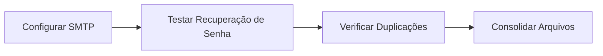

# 🔍 PLANO DE AUDITORIA GERAL - OUVY SAAS

**Data:** 14 de Janeiro de 2026  
**Versão do Documento:** 1.0  
**Objetivo:** Auditoria completa do sistema para deploy final em produção  
**Responsável:** Equipe de Desenvolvimento

---

## 📋 ÍNDICE

1. [Visão Geral do Projeto](#1-visão-geral-do-projeto)
2. [Status Atual do Sistema](#2-status-atual-do-sistema)
3. [Checklist de Auditoria](#3-checklist-de-auditoria)
4. [Verificação de Integridade](#4-verificação-de-integridade)
5. [Detecção de Duplicações e Redundâncias](#5-detecção-de-duplicações-e-redundâncias)
6. [Auditoria de Segurança](#6-auditoria-de-segurança)
7. [Auditoria de Performance](#7-auditoria-de-performance)
8. [Conformidade (LGPD/GDPR)](#8-conformidade-lgpdgdpr)
9. [Funcionalidades Pendentes](#9-funcionalidades-pendentes)
10. [Plano de Execução](#10-plano-de-execução)
11. [Critérios de Aprovação para Deploy](#11-critérios-de-aprovação)
12. [Recomendações Finais](#12-recomendações-finais)

---

## 1. VISÃO GERAL DO PROJETO

### 🎯 Descrição do Produto

**Ouvy** é uma plataforma SaaS White Label para canais de feedback corporativo, permitindo que empresas recebam e gerenciem:

- 🚨 **Denúncias** - Canal seguro e anônimo
- 💬 **Reclamações** - Gestão de insatisfações
- 💡 **Sugestões** - Coleta de ideias e melhorias
- ⭐ **Elogios** - Reconhecimento positivo

**Diferencial:** Sistema de protocolo único (ex: `OUVY-A3B2-C9D4`) para rastreamento de interações.

### 🏗️ Arquitetura Tecnológica

```
┌─────────────────────────────────────────────────────────────────┐
│                      INFRAESTRUTURA                              │
├─────────────────────────────────────────────────────────────────┤
│                                                                  │
│   ┌─────────────────┐         ┌─────────────────────────────┐   │
│   │    VERCEL       │         │        RAILWAY              │   │
│   │   (Frontend)    │  HTTPS  │        (Backend)            │   │
│   │                 │◄───────►│                             │   │
│   │  Next.js 15     │  CORS   │  Django 6.0.1 + DRF 3.15    │   │
│   │  TailwindCSS    │         │  PostgreSQL                  │   │
│   │  TypeScript     │         │  Gunicorn                    │   │
│   └─────────────────┘         └───────────┬─────────────────┘   │
│                                           │                      │
│                                           │ Webhook              │
│                                           ▼                      │
│                               ┌─────────────────────────────┐   │
│                               │        STRIPE               │   │
│                               │    (Pagamentos)             │   │
│                               └─────────────────────────────┘   │
│                                                                  │
└─────────────────────────────────────────────────────────────────┘
```

### 📂 Estrutura de Diretórios

```
ouvy_saas/
├── ouvy_saas/              # Backend Django
│   ├── apps/
│   │   ├── core/           # Middleware, Utils, Segurança
│   │   ├── tenants/        # Gestão de Clientes (Multi-tenant)
│   │   └── feedbacks/      # Sistema de Feedbacks
│   └── config/             # Configurações Django
│
├── ouvy_frontend/          # Frontend Next.js
│   ├── app/                # Páginas (App Router)
│   ├── components/         # Componentes UI
│   ├── contexts/           # React Context (Auth)
│   ├── hooks/              # Custom Hooks
│   └── lib/                # Utils, API, Types
│
├── docs/                   # Documentação
├── apps/                   # Apps Django (DUPLICADO - verificar)
└── [arquivos raiz]         # Scripts, configs, testes
```

### 🌐 URLs de Produção

| Serviço | URL | Status |
|---------|-----|--------|
| Backend API | `https://ouvy-saas-production.up.railway.app` | ✅ Ativo |
| Frontend | `https://ouvy-frontend.vercel.app` | ✅ Ativo |
| Documentação API | `/swagger/` ou `/redoc/` | ✅ Ativo |

---

## 2. STATUS ATUAL DO SISTEMA

### 📊 Score Geral de Qualidade

| Módulo | Score | Status |
|--------|-------|--------|
| Backend | 93.5/100 | ✅ Excelente |
| Frontend | 95.0/100 | ✅ Excelente |
| **Média Geral** | **94.25/100** | 🏆 Pronto para Produção |

### ✅ Funcionalidades Implementadas

| Funcionalidade | Backend | Frontend | Status |
|----------------|---------|----------|--------|
| Cadastro de Tenant | ✅ | ✅ | 100% |
| Login/Logout | ✅ | ✅ | 100% |
| Recuperação de Senha | ✅ | ✅ | 100% |
| CRUD Feedbacks | ✅ | ✅ | 100% |
| Rastreamento por Protocolo | ✅ | ✅ | 100% |
| Sistema de Respostas/Interações | ✅ | ✅ | 100% |
| Pagamentos Stripe | ✅ | ✅ | 100% |
| Gestão de Assinaturas | ✅ | ✅ | 100% |
| Dashboard Analytics | ✅ | 🟡 | 80% |
| Painel Admin | ✅ | 🟡 | 70% |
| Notificações Email | ❌ | ❌ | 0% |
| Subdomínio Dinâmico | ✅ | 🟡 | 80% |
| Exportação de Dados | ❌ | ❌ | 0% |

### ❌ Funcionalidades Pendentes (Críticas)

1. **Sistema de Notificações por Email**
   - Prioridade: **ALTA**
   - Necessário para: Recuperação de senha, notificações de feedback
   - Ação: Configurar SMTP (SendGrid, AWS SES, etc.)

2. **Exportação de Dados (LGPD)**
   - Prioridade: **MÉDIA**
   - Necessário para: Compliance com direito de portabilidade
   - Ação: Endpoint `/api/export-data/`

---

## 3. CHECKLIST DE AUDITORIA

### 3.1 Backend Django

#### Configurações de Produção

- [x] `DEBUG=False` via variável de ambiente
- [x] `SECRET_KEY` única e segura (não padrão)
- [x] `ALLOWED_HOSTS` configurado (Railway + wildcards)
- [x] `DATABASE_URL` para PostgreSQL
- [x] `CORS_ALLOWED_ORIGINS` restrito ao frontend
- [x] Headers de segurança (HSTS, XSS, CSP)
- [x] Gunicorn configurado com workers adequados

#### Segurança

- [x] Token Authentication (DRF)
- [x] Isolamento Multi-tenant (TenantMiddleware)
- [x] Rate Limiting (consulta de protocolo)
- [x] Validação de inputs (serializers)
- [x] Proteção CSRF (desabilitado para API token-based)
- [x] Logs mascarados (emails, tokens)
- [ ] Token expiration (JWT) - Recomendado
- [ ] 2FA - Roadmap futuro

#### Banco de Dados

- [x] Índices otimizados em Feedback
- [x] select_related para evitar N+1
- [x] Transações atômicas em operações críticas
- [x] Migrations atualizadas

#### API Endpoints

| Endpoint | Método | Autenticação | Status |
|----------|--------|--------------|--------|
| `/api/tenant-info/` | GET | Pública | ✅ |
| `/api/register-tenant/` | POST | Pública | ✅ |
| `/api/check-subdominio/` | GET | Pública | ✅ |
| `/api/feedbacks/` | GET/POST | Autenticada | ✅ |
| `/api/feedbacks/{id}/` | GET/PUT | Autenticada | ✅ |
| `/api/feedbacks/consultar-protocolo/` | GET | Pública + Rate Limit | ✅ |
| `/api/feedbacks/responder-protocolo/` | POST | Pública | ✅ |
| `/api/feedbacks/dashboard-stats/` | GET | Autenticada | ✅ |
| `/api-token-auth/` | POST | Pública | ✅ |
| `/api/password-reset/request/` | POST | Pública | ✅ |
| `/api/password-reset/confirm/` | POST | Pública | ✅ |
| `/api/tenants/subscribe/` | POST | Autenticada | ✅ |
| `/api/tenants/webhook/` | POST | Stripe Signature | ✅ |
| `/api/tenants/subscription/` | GET/DELETE/PATCH | Autenticada | ✅ |
| `/api/admin/tenants/` | GET/PATCH | Admin Only | ✅ |
| `/health/` | GET | Pública | ✅ |
| `/ready/` | GET | Pública | ✅ |

### 3.2 Frontend Next.js

#### Páginas Implementadas

| Rota | Descrição | Autenticação | Status |
|------|-----------|--------------|--------|
| `/` | Landing Page | Pública | ✅ |
| `/login` | Autenticação | Pública | ✅ |
| `/cadastro` | Registro de Tenant | Pública | ✅ |
| `/recuperar-senha` | Reset de Senha | Pública | ✅ |
| `/acompanhar` | Rastrear Protocolo | Pública | ✅ |
| `/enviar` | Enviar Feedback | Pública | ✅ |
| `/precos` | Planos e Preços | Pública | ✅ |
| `/recursos` | Features | Pública | ✅ |
| `/demo` | Demonstração | Pública | ✅ |
| `/termos` | Termos de Uso | Pública | ✅ |
| `/privacidade` | Política de Privacidade | Pública | ✅ |
| `/dashboard` | Painel Principal | Protegida | ✅ |
| `/dashboard/feedbacks` | Lista de Feedbacks | Protegida | ✅ |
| `/dashboard/feedbacks/[protocolo]` | Detalhes do Feedback | Protegida | ✅ |
| `/dashboard/relatorios` | Analytics | Protegida | ✅ |
| `/dashboard/configuracoes` | Config. do Tenant | Protegida | ✅ |
| `/dashboard/perfil` | Perfil do Usuário | Protegida | ✅ |
| `/admin` | Painel Admin | Admin | 🟡 70% |

#### Componentes e Libs

- [x] Design System completo (UI components)
- [x] AuthContext (gerenciamento de autenticação)
- [x] API Client (axios com interceptors)
- [x] Logger condicional (apenas dev)
- [x] Sanitização de HTML (DOMPurify)
- [x] ErrorBoundary
- [x] ProtectedRoute

#### Testes

- [x] Unit tests (Jest + Testing Library)
- [x] Cobertura de componentes UI
- [ ] Testes E2E (Cypress/Playwright) - Recomendado

---

## 4. VERIFICAÇÃO DE INTEGRIDADE

### 4.1 Arquivos de Configuração

| Arquivo | Local | Status | Observação |
|---------|-------|--------|------------|
| `settings.py` | `ouvy_saas/config/` | ✅ Correto | Produção-ready |
| `urls.py` | `ouvy_saas/config/` | ✅ Correto | Rotas organizadas |
| `vercel.json` | Raiz + `ouvy_frontend/` | ⚠️ Duplicado | Verificar qual usar |
| `railway.json` | `ouvy_saas/` + `ouvy_frontend/` | ⚠️ Duplicado | Ambos são válidos |
| `requirements.txt` | Raiz | ✅ Correto | Dependências Python |
| `package.json` | Raiz + `ouvy_frontend/` | ⚠️ Verificar | Raiz parece redundante |

### 4.2 Estrutura de Apps Django

**⚠️ DUPLICAÇÃO DETECTADA:**

```
ouvy_saas/
├── apps/               # Pasta de apps (VAZIA ou obsoleta?)
│   ├── core/
│   ├── feedbacks/
│   └── tenants/
│
└── ouvy_saas/          # Projeto Django
    └── apps/           # Pasta de apps (REAL - com código)
        ├── core/
        ├── feedbacks/
        └── tenants/
```

**Ação Necessária:** 
- Verificar se `/ouvy_saas/apps/` (raiz) está sendo usada
- Se não, remover para evitar confusão
- Se sim, consolidar em um único local

### 4.3 Imports e Dependências

**Backend:**
- [x] Imports relativos consistentes (`from apps.xxx import`)
- [x] `sys.path` configurado em settings.py
- [x] Sem imports circulares detectados

**Frontend:**
- [x] Path aliases configurados (`@/lib`, `@/components`)
- [x] TypeScript strict mode
- [x] Sem dependências não utilizadas detectadas

---

## 5. DETECÇÃO DE DUPLICAÇÕES E REDUNDÂNCIAS

### 5.1 Arquivos Duplicados/Redundantes

| Arquivo | Localização 1 | Localização 2 | Ação |
|---------|---------------|---------------|------|
| `vercel.json` | `/vercel.json` | `/ouvy_frontend/vercel.json` | Manter apenas no frontend |
| `railway.json` | `/ouvy_saas/railway.json` | `/ouvy_frontend/railway.json` | OK - São diferentes (backend/frontend) |
| `package.json` | `/package.json` | `/ouvy_frontend/package.json` | Verificar se raiz é necessário |
| `apps/` | `/apps/` | `/ouvy_saas/apps/` | **CONSOLIDAR** |

### 5.2 Documentação Redundante

**Arquivos na raiz que podem ser consolidados em `/docs/`:**

```
RAIZ (78 arquivos .md total)
├── ACTION_PLAN.txt                    # → Mover para docs/
├── AUDITORIA_RESUMO.md               # → Mover para docs/
├── CORRECOES_APLICADAS.md            # → Mover para docs/
├── DEPLOYMENT_STATUS.txt             # → Mover para docs/
├── DESIGN_SYSTEM_COMPLETE.txt        # → Mover para docs/
├── FINAL_SUMMARY.txt                 # → Mover para docs/
├── IDENTITY_VISUAL_SUMMARY.txt       # → Mover para docs/
├── NEXT_STEPS_SUMMARY.txt            # → Mover para docs/
├── PLANO_AUDITORIA_COMPLETA.md       # → Mover para docs/
├── QA_CHECKLIST.md                   # → Mover para docs/
├── QUICK_REFERENCE.md                # → Mover para docs/
├── QUICK_START_BACKEND.md            # → Mover para docs/
├── RELATORIO_AUDITORIA_FINAL.md      # → Mover para docs/
├── REVISAO_MICRO_BACKEND.md          # → Mover para docs/
├── REVISAO_MICRO_FRONTEND.md         # → Mover para docs/
├── ROADMAP.md                        # → Mover para docs/
├── STATUS_CONSOLIDADO_AUDITORIAS.md  # → Mover para docs/
├── SUMMARY_REVISION.txt              # → Mover para docs/
└── ...
```

**Ação Recomendada:**
1. Manter na raiz: `README.md`, `LICENSE`, `.env.example`
2. Mover para `/docs/`: Toda documentação de desenvolvimento
3. Arquivar em `/docs/archive_2026/`: Documentos históricos

### 5.3 Scripts Redundantes

```
Scripts de inicialização:
├── start.sh
├── run_server.sh
├── restart_server.sh
├── RUN_ME_FIRST.sh
├── START_HERE.sh
└── check_deploy.sh

Scripts de teste:
├── test_full_integration.sh
├── test_integracao_frontend.sh
├── test_integration.sh
└── run_test.sh
```

**Ação:** Consolidar em um único `scripts/` ou documentar qual usar.

---

## 6. AUDITORIA DE SEGURANÇA

### 6.1 OWASP Top 10 Checklist

| Vulnerabilidade | Status | Implementação |
|-----------------|--------|---------------|
| **A01 - Broken Access Control** | ✅ Protegido | TenantMiddleware + IsAuthenticated |
| **A02 - Cryptographic Failures** | ✅ Protegido | HTTPS, Tokens hasheados |
| **A03 - Injection** | ✅ Protegido | Django ORM, Serializers |
| **A04 - Insecure Design** | ✅ Protegido | Arquitetura multi-tenant segura |
| **A05 - Security Misconfiguration** | ✅ Protegido | Settings de produção validados |
| **A06 - Vulnerable Components** | ⚠️ Verificar | Atualizar dependências regularmente |
| **A07 - Auth Failures** | ✅ Protegido | Token auth + rate limiting |
| **A08 - Data Integrity** | ✅ Protegido | Validação em serializers |
| **A09 - Logging Failures** | ✅ Protegido | Logs estruturados e mascarados |
| **A10 - SSRF** | ✅ Protegido | Não há requisições server-side externas |

### 6.2 Headers de Segurança

```python
# Backend (Django settings.py)
SECURE_HSTS_SECONDS = 31536000        # ✅
SECURE_HSTS_INCLUDE_SUBDOMAINS = True # ✅
SECURE_BROWSER_XSS_FILTER = True      # ✅
SECURE_CONTENT_TYPE_NOSNIFF = True    # ✅
X_FRAME_OPTIONS = 'DENY'              # ✅
CSP configurado                       # ✅
Permissions-Policy configurado        # ✅
```

```json
// Frontend (vercel.json)
{
  "X-Content-Type-Options": "nosniff",       // ✅
  "X-Frame-Options": "DENY",                  // ✅
  "X-XSS-Protection": "1; mode=block",        // ✅
  "Referrer-Policy": "strict-origin-when-cross-origin", // ✅
  "Permissions-Policy": "geolocation=(), microphone=(), camera=()", // ✅
  "Strict-Transport-Security": "max-age=31536000; includeSubDomains; preload" // ✅
}
```

### 6.3 Proteções Implementadas

| Proteção | Status | Detalhes |
|----------|--------|----------|
| Rate Limiting | ✅ | 5 req/min protocolo, 3 req/hora reset senha |
| SQL Injection | ✅ | Django ORM |
| XSS | ✅ | DOMPurify (frontend), escape (backend) |
| CSRF | ✅ | Token-based auth (não usa cookies) |
| Brute Force | ✅ | Rate limiting + validação forte |
| Directory Traversal | ✅ | Django file handling |
| Session Hijacking | N/A | Token-based (não usa sessões) |

### 6.4 Vulnerabilidades Conhecidas

| Severidade | Item | Status | Recomendação |
|------------|------|--------|--------------|
| 🟡 Média | Tokens não expiram | Pendente | Implementar JWT ou rotation |
| 🟡 Média | Email SMTP mockado | Pendente | Configurar provedor real |
| 🟢 Baixa | 2FA não implementado | Roadmap | Adicionar em v2.0 |
| 🟢 Baixa | Audit logs | Pendente | Logs de ações administrativas |

---

## 7. AUDITORIA DE PERFORMANCE

### 7.1 Backend

| Item | Status | Métrica |
|------|--------|---------|
| Índices de banco | ✅ | 5 índices em Feedback |
| N+1 Queries | ✅ | select_related implementado |
| Cache | ✅ | TenantInfo cached 5 min |
| Paginação | ✅ | 20 items/página (max 100) |
| Timeout API | ✅ | 15s no cliente |
| Workers Gunicorn | ✅ | 3 workers configurados |

### 7.2 Frontend

| Item | Status | Métrica |
|------|--------|---------|
| Bundle Size | ✅ | Otimizado por Next.js |
| Code Splitting | ✅ | App Router automático |
| Image Optimization | ✅ | next/image |
| Debounce em Buscas | ✅ | 500ms |
| Loading States | ✅ | Implementados |
| Error Boundaries | ✅ | Implementado |

### 7.3 Melhorias Recomendadas

- [ ] Implementar skeleton loaders
- [ ] Adicionar service worker (PWA)
- [ ] Lazy loading de componentes pesados
- [ ] CDN para assets estáticos

---

## 8. CONFORMIDADE (LGPD/GDPR)

### 8.1 Checklist de Conformidade

| Requisito | Status | Implementação |
|-----------|--------|---------------|
| Política de Privacidade | ✅ | `/privacidade` |
| Termos de Uso | ✅ | `/termos` |
| Consentimento de Cookies | ⚠️ Pendente | Banner necessário |
| Direito ao Esquecimento | ⚠️ Pendente | Endpoint de exclusão |
| Portabilidade de Dados | ⚠️ Pendente | Endpoint de exportação |
| Opt-in para Marketing | N/A | Não há marketing por email |
| Logs de Consentimento | ⚠️ Pendente | Registrar aceites |
| Criptografia de Dados | ✅ | HTTPS, hash de tokens |
| Minimização de Dados | ✅ | Coleta apenas necessário |
| Isolamento de Dados | ✅ | Multi-tenant |

### 8.2 Ações Necessárias para LGPD

1. **Implementar Banner de Cookies**
   - Prioridade: Alta
   - Componente: `CookieConsent`

2. **Endpoint de Exclusão de Conta**
   - `DELETE /api/account/`
   - Excluir dados do usuário e tenant

3. **Endpoint de Exportação de Dados**
   - `GET /api/export-data/`
   - Formato: JSON ou CSV

---

## 9. FUNCIONALIDADES PENDENTES

### 9.1 Críticas (Bloqueantes para Produção)

| # | Funcionalidade | Prioridade | Esforço | Impacto |
|---|----------------|------------|---------|---------|
| 1 | **SMTP para Emails** | 🔴 CRÍTICA | 2h | Recuperação de senha não funcional |

### 9.2 Importantes (Pós-launch)

| # | Funcionalidade | Prioridade | Esforço | Descrição |
|---|----------------|------------|---------|-----------|
| 2 | Notificações por Email | Alta | 8h | Alertas de novo feedback |
| 3 | Exportação LGPD | Alta | 4h | Compliance obrigatório |
| 4 | Banner de Cookies | Alta | 2h | Compliance obrigatório |
| 5 | Dashboard Analytics melhorado | Média | 16h | Gráficos, relatórios |
| 6 | Painel Admin completo | Média | 16h | CRUD de tenants no frontend |
| 7 | Subdomínio dinâmico | Média | 8h | White-label completo |

### 9.3 Melhorias Futuras (Roadmap)

| # | Funcionalidade | Versão | Descrição |
|---|----------------|--------|-----------|
| 1 | JWT Tokens | v1.1 | Tokens com expiração |
| 2 | 2FA | v2.0 | Autenticação em duas etapas |
| 3 | PWA | v2.0 | App offline |
| 4 | Webhooks para clientes | v2.0 | Integração externa |
| 5 | API pública | v2.0 | Documentação e SDKs |
| 6 | Multi-idioma | v2.0 | i18n |

---

## 10. PLANO DE EXECUÇÃO

### Fase 1: Correções Críticas (Dia 1)



**Tarefas:**
1. [ ] Configurar provedor SMTP (SendGrid/AWS SES)
2. [ ] Testar fluxo completo de recuperação de senha
3. [ ] Remover/mover pasta `/apps/` duplicada
4. [ ] Organizar documentação na pasta `/docs/`
5. [ ] Remover `vercel.json` da raiz

### Fase 2: Compliance LGPD (Dia 2)

**Tarefas:**
1. [ ] Implementar banner de cookies
2. [ ] Criar endpoint de exclusão de conta
3. [ ] Criar endpoint de exportação de dados
4. [ ] Registrar logs de consentimento

### Fase 3: Validação Final (Dia 3)

**Tarefas:**
1. [ ] Executar testes de integração
2. [ ] Validar todos os endpoints da API
3. [ ] Testar fluxos completos (cadastro, login, feedback, pagamento)
4. [ ] Verificar performance em produção
5. [ ] Scan de segurança final

### Fase 4: Deploy Final (Dia 4)

**Tarefas:**
1. [ ] Revisar variáveis de ambiente
2. [ ] Executar migrations em produção
3. [ ] Validar health checks
4. [ ] Configurar monitoramento (se aplicável)
5. [ ] Documentar procedimentos de rollback

---

## 11. CRITÉRIOS DE APROVAÇÃO

### Para Deploy em Produção

| Critério | Peso | Status Atual |
|----------|------|--------------|
| Todas as funcionalidades core funcionando | 30% | ✅ 100% |
| Segurança crítica implementada | 25% | ✅ 95% |
| SMTP configurado | 15% | ❌ 0% |
| Performance aceitável (<3s) | 10% | ✅ OK |
| Testes passando | 10% | ✅ OK |
| Documentação atualizada | 10% | ✅ OK |

**Score Atual:** ~85%  
**Score Mínimo para Deploy:** 90%  
**Bloqueador Principal:** SMTP não configurado

---

## 12. RECOMENDAÇÕES FINAIS

### Ações Imediatas (Antes do Deploy)

1. **🔴 CRÍTICO: Configurar SMTP**
   - Sem isso, recuperação de senha não funciona em produção
   - Opções: SendGrid, AWS SES, Mailgun

2. **🟡 IMPORTANTE: Consolidar estrutura**
   - Remover duplicações identificadas
   - Organizar documentação

3. **🟡 IMPORTANTE: Banner de Cookies**
   - Necessário para compliance LGPD

### Monitoramento Pós-Deploy

- [ ] Configurar alertas de erro (Sentry)
- [ ] Monitorar uso de recursos (Railway Analytics)
- [ ] Acompanhar métricas de API
- [ ] Backup automático de banco

### Próximas Versões

1. **v1.1** - Token rotation, notificações email
2. **v1.2** - Dashboard analytics melhorado
3. **v2.0** - 2FA, PWA, webhooks

---

## 📝 REGISTRO DE ALTERAÇÕES

| Data | Versão | Alteração | Autor |
|------|--------|-----------|-------|
| 14/01/2026 | 1.0 | Criação do plano de auditoria | Equipe |

---

**📌 Este documento deve ser revisado e atualizado conforme o progresso da auditoria.**

